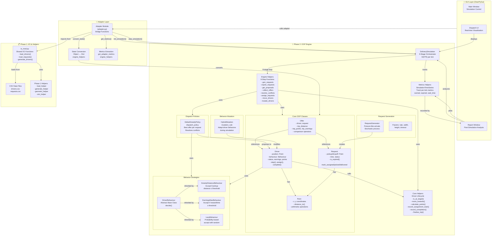
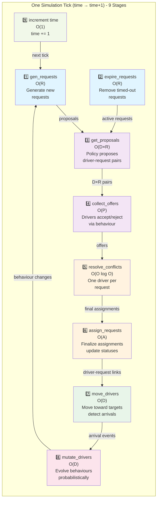
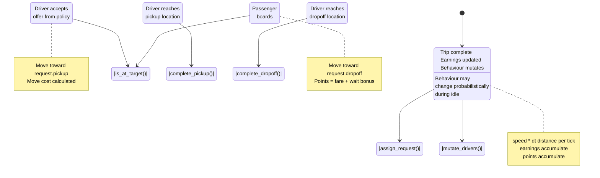
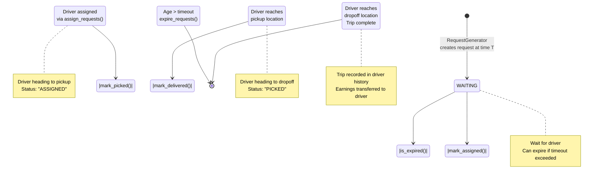
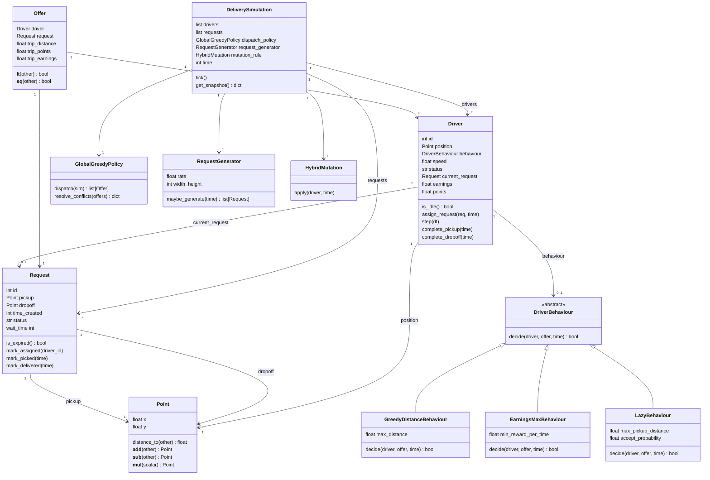
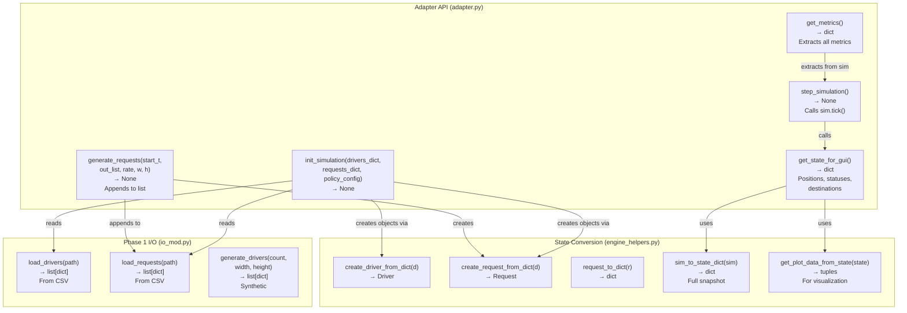
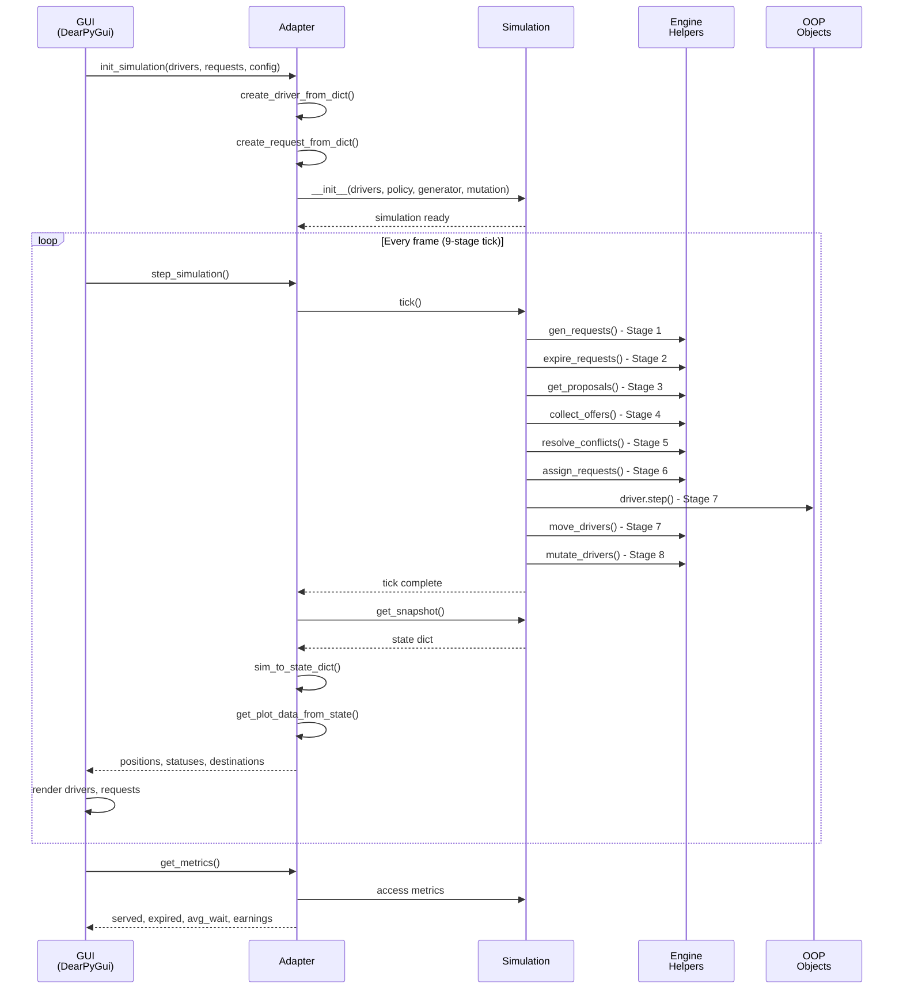

# Phase 2 Architecture Diagram - Latest Version

## 1. Complete System Architecture



---

## 2. Data Flow: One Complete Simulation Tick



---

## 3. Driver Lifecycle State Machine



---

## 4. Request Lifecycle



---

## 5. Class Dependencies and Inheritance



---

## 6. Adapter Functions - Bridge Between GUI and Simulation



---

## 7. Complexity Analysis: Per Tick (9-Stage Orchestration)

```
Stage 1: gen_requests()        O(R)           Generate new requests
Stage 2: expire_requests()     O(R)           Check all requests for timeout
Stage 3: get_proposals()       O(D×R) worst   Policy checks each driver vs each request
Stage 4: collect_offers()      O(P)           P ≤ D×R, drivers evaluate proposals
Stage 5: resolve_conflicts()   O(O log O)     Sort offers per request, O = offers
Stage 6: assign_requests()     O(A)           A ≤ O, finalize assignments
Stage 7: move_drivers()        O(D)           Move D drivers toward targets
Stage 8: mutate_drivers()      O(D)           Apply mutations to D drivers
Stage 9: increment time        O(1)           time += 1

TOTAL per tick: O(D×R×log(D×R) + D + R)

With typical values (D=10 drivers, R=100 requests):
  → ~10,000 operations per tick
  → 1,000 ticks = ~10 million operations
  → < 1 second on modern hardware
```

---

## 8. Key Components Summary

| Component | Type | Role | Location |
|-----------|------|------|----------|
| **Point** | Value Class | 2D coordinates + distance | point.py |
| **Request** | State Machine | Pickup/dropoff task with lifecycle | request.py |
| **Driver** | Agent | Mobile unit with behaviour + earnings | driver.py |
| **Offer** | Decision Artifact | Driver-request pair for assignment | offer.py |
| **DriverBehaviour** | Strategy Pattern | Abstract behaviour (Greedy, Earnings, Lazy) | behaviours.py |
| **GlobalGreedyPolicy** | Dispatch Rule | Best offer per request | policies.py |
| **RequestGenerator** | Stochastic | Poisson arrivals | generator.py |
| **HybridMutation** | Evolution Rule | Adapt driver behaviours | mutation.py |
| **DeliverySimulation** | Orchestrator | 9-phase tick loop | simulation.py |
| **Engine Helpers** | Procedural | Step implementations | helpers_2/engine_helpers.py |
| **Core Helpers** | Lifecycle | Driver movement/trip logic | helpers_2/core_helpers.py |
| **Adapter** | Bridge | GUI ↔ Simulation interface | adapter.py |
| **Report Window** | Analysis | Post-sim metrics visualization | report_window.py |

---

## 9. Information Flow: GUI to Simulation



---

## 10. File Organization

```
exam_phase2/
├── phase1/
│   ├── __init__.py
│   ├── io_mod.py                 ← Shared I/O (load/generate)
│   ├── phase1.py
│   ├── sim_mod.py
│   └── helpers_1/
│       ├── load_helper.py
│       ├── generate_helper.py
│       ├── geometri_helper.py
│       ├── metrics_helper.py
│       └── sim_helper.py
│
├── phase2/                        ← OOP Simulation Engine
│   ├── __init__.py
│   ├── point.py                  ← Value: 2D point
│   ├── request.py                ← State machine: request lifecycle
│   ├── driver.py                 ← Agent: delivers requests
│   ├── offer.py                  ← Decision artifact
│   ├── behaviours.py             ← Strategy: Greedy, Earnings, Lazy
│   ├── policies.py               ← Dispatch rule: GlobalGreedyPolicy
│   ├── generator.py              ← Stochastic request generation
│   ├── mutation.py               ← Behaviour evolution
│   ├── simulation.py             ← Orchestrator: 9-phase tick
│   ├── adapter.py                ← GUI bridge
│   ├── report_window.py          ← Post-sim visualization
│   └── helpers_2/
│       ├── core_helpers.py       ← Driver lifecycle (used by driver.py)
│       ├── engine_helpers.py     ← 9-step orchestration (used by simulation.py)
│       ├── metrics_helpers.py    ← Time-series tracking
│       ├── generator_helpers.py  ← (reference, unused)
│       ├── mutation_helpers.py   ← (reference, unused)
│       └── offer_helpers.py      ← (reference, unused)
│
├── gui/
│   ├── _engine.py
│   └── __pycache__/
│
├── data/
│   ├── drivers.csv
│   ├── drivers2.csv
│   ├── drivers3.csv
│   ├── drivers4.csv
│   ├── requests.csv
│   ├── requests2.csv
│   └── requests3.csv
│
├── test/
│   ├── test_point.py
│   ├── test_request.py
│   ├── test_driver.py
│   ├── test_offer.py
│   ├── test_behaviours.py
│   ├── test_policies.py
│   ├── test_simulation.py
│   └── __pycache__/
│
└── ARCHITECTURE_LATEST.md        ← This file
```

---

## Notes on Latest Changes

✅ **Updated Components:**
- `adapter.py`: Full bridge API with state conversion functions
- `behaviours.py`: Enhanced with type validation, clear decision logic
- `engine_helpers.py`: Added comprehensive Big O complexity docstring
- `driver.py`: Integrated with core_helpers for lifecycle management
- `simulation.py`: 9-phase orchestration with proper state tracking
- `report_window.py`: Post-simulation analysis and visualization

✅ **Key Architecture Principles:**
1. **Adapter Pattern**: GUI talks only to adapter, not direct simulation
2. **Strategy Pattern**: Pluggable behaviour strategies for drivers
3. **State Machines**: Request and Driver have well-defined lifecycle states
4. **Separation of Concerns**: 9-stage orchestration (engine_helpers) vs. core logic (classes)
5. **Type Safety**: Type checks in behaviours for robust validation
6. **Complexity Awareness**: O(D×R) orchestration understood and documented
7. **Stage-Based Orchestration**: 9 discrete stages per tick for clear flow control
