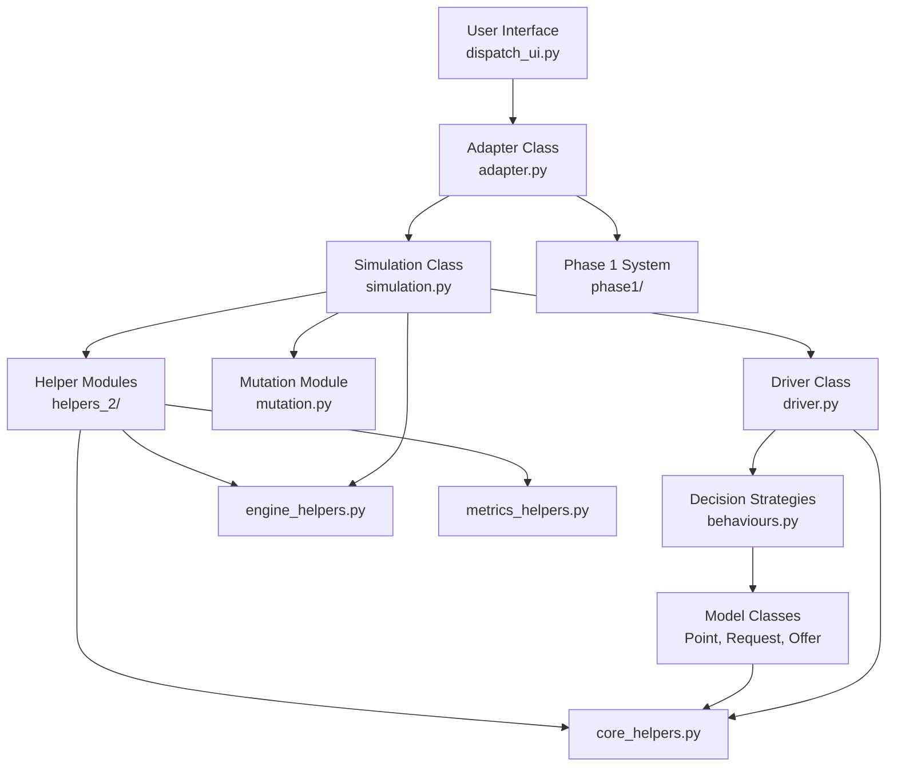
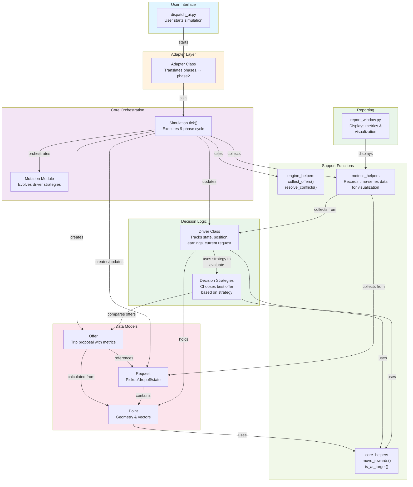

# Food Delivery Simulation - Phase 2: Object-Oriented Design & Testing

**DS830 - Introduction to Programming**

**Exam Project Phase 2 Report**

**December 13, 2025**

---

## Contents

1. Introduction
2. System Architecture
3. Implementation
   - 3.1 Core Data Models
   - 3.2 Behaviour Strategies
   - 3.3 Simulation Orchestration
   - 3.4 Helper Functions
4. Testing Strategy
5. Metrics and Logging
6. Conclusion
7. Appendix
   - 7.1 System Architecture Diagram
   - 7.2 Source Code Overview
   - 7.3 Test Coverage Summary

---

## 1. Introduction

Phase 2 of the Food Delivery Simulation project represents a significant architectural evolution from Phase 1's procedural approach. While Phase 1 focused on functional decomposition with data stored in simple dictionaries, Phase 2 introduces object-oriented design principles to create a more maintainable, testable, and extensible system.

The Phase 2 implementation maintains the core simulation logic—drivers delivering requests on a 2D grid—but refactors it into discrete, well-defined classes. Each class encapsulates specific concerns: the `Point` class handles geometric operations, the `Request` and `Offer` classes model the domain entities, the `Driver` class manages individual actor state and behaviour, and the `DeliverySimulation` class orchestrates the entire system.

A critical addition is the comprehensive testing suite. With 127 unit tests covering Point operations, Driver behaviour strategies, and Simulation orchestration, the codebase now demonstrates professional-grade quality assurance. The tests use Python's `unittest` framework combined with strategic mocking to ensure each class and module works correctly both in isolation and as part of the larger system.

This report documents the architectural decisions, implementation details, and testing approach that enable Phase 2 to serve as a production-ready foundation for further extensions.

---

## 2. System Architecture

The Phase 2 architecture is built on clear separation of concerns, with well-organized classes and modules that make the system easy to understand, test, and extend.

### 2.1 Core Classes and Modules

**Model Classes** (`phase2/point.py`, `phase2/request.py`, `phase2/offer.py`) hold the fundamental objects: Points, Requests, and Offers. These are straightforward data structures with no simulation logic attached, which makes them easy to test in isolation and reuse throughout the system. They serve as the basic building blocks everything else depends on.

**Decision Strategies** (`phase2/behaviours.py`) contains the different ways drivers make choices. Rather than putting decision logic into the driver class itself, we've isolated it into separate strategy classes (GreedyDistance, EarningsMax, Lazy). This means you can test each strategy independently and swap in new ones without touching the driver code.

**Driver Class** (`phase2/driver.py`) represents individual drivers in the simulation. Each driver tracks their own position, earnings, current behaviour strategy, and whether they're carrying a delivery. For calculations around movement and metrics, the driver leans on helpers—but it always stays in control of its own state.

**Simulation Class** (`phase2/simulation.py`) is the conductor of the whole system. It runs each simulation step through a structured 9-phase process: advance time, activate requests, handle timeouts, assign drivers, collect offers, resolve conflicts, move drivers, update strategies, and mutate behaviours. This predictable flow makes it easy to understand what happens and in what order.

**Mutation Module** (`phase2/mutation.py`) lets drivers evolve during the simulation. Instead of staying locked into one strategy, drivers can adapt based on how well they're doing. If a driver isn't earning enough, they might switch to distance-focused pickups. If they're stagnating despite doing okay, they might try something new. This adds realism—drivers learn and adjust over time.

**Helper Modules** (`phase2/helpers_2/`) contains utility functions that do the heavy lifting. Core helpers handle basic geometry and state changes. Engine helpers implement the complex orchestration logic for things like conflict resolution. Metrics helpers track what's happening over time so we can analyze simulation performance later.

**Adapter Class** (`phase2/adapter.py`) lets Phase 1 and Phase 2 work together. Since Phase 1 used dictionaries and Phase 2 uses objects, the adapter translates between the two formats. This means we can run both systems side-by-side or gradually migrate from one to the other.

**Phase 1 System** (`phase1/`) is the original procedural implementation that drove all the initial development. It's still there and still functional—the adapter lets Phase 2 leverage Phase 1's logic when needed. For teaching purposes, keeping Phase 1 alongside Phase 2 shows the architectural evolution.

### 2.2 Class and Module Relationships



### 2.3 Complete Architecture Overview



---

## 3. Implementation

### 3.1 Designing with Objects: Why OOP Matters Here

The Phase 2 system was built entirely using object-oriented principles, and this choice fundamentally shapes how the simulation works. Rather than writing a single procedural script that handles everything, we organized the code into distinct classes—each responsible for one concept, communicating through well-defined methods. This matters because it makes the system flexible, testable, and understandable.

**What does "object-oriented" mean for this delivery simulation?** Instead of scattering global variables and functions everywhere, we represent the real world directly as objects. A `Point` is a location on the map. A `Request` is a customer's order. A `Driver` is a person making deliveries. Each object knows how to manage its own data and what it can do. When a driver needs to know how far away a pickup is, we don't dig through raw coordinate numbers—we just ask the `Point` to calculate the distance using `driver.get_distance_to(point)`. The Point handles the math internally.

This approach yields three major benefits in our system:

**Encapsulation:** The `Request` class manages its own lifecycle. When a request transitions from WAITING to ASSIGNED to PICKED_UP to DELIVERED, it does so through controlled methods (`assign()`, `mark_picked_up()`, `mark_delivered()`) that ensure state never becomes inconsistent. The Simulation can't accidentally leave a request in an invalid state because the Request class itself guarantees correctness. Similarly, the `Driver` class controls its own position and earnings—external code can't arbitrarily change them, only trigger valid transitions like `assign_request()` or `step()`.

**Composition:** The system is built from simple components that work together. A `Driver` object contains a `Point` for position, a `BehaviourStrategy` for decision-making, and references to `Request` objects it's delivering. The `Simulation` object contains collections of all these components and orchestrates how they interact. Rather than inheritance hierarchies where classes inherit from parents, we use composition where objects contain other objects—this keeps complexity low and flexibility high. When we want drivers to change strategies, they can swap their strategy object at runtime without changing their class.

**Polymorphism (through Strategy Pattern):** The system supports multiple decision-making strategies, and they all work through the same interface. Whether a driver uses `GreedyDistance` (shortest pickup distance), `EarningsMax` (highest income), or `Lazy` (probabilistic choice), the `Driver` object calls `strategy.decide(offers)` on whichever strategy it holds. The simulation doesn't need to know which strategy a driver has—it treats all strategies identically because they all implement the same method. This means new strategies can be added without modifying any existing driver or simulation code.

**Separation of Concerns:** Mathematical operations live in the `Point` class, request logic lives in the `Request` class, decision-making lives in strategy classes, and orchestration lives in `Simulation`. Helper functions handle specialized computations (conflict resolution, metrics tracking). Each piece of code has a single responsibility, making it easy to understand what a class does, easy to test it independently, and easy to modify it without breaking other parts.

### 3.2 The Building Blocks: Core Classes

#### 3.2.1 Points, Geometry, and Distance Calculations

The `Point` class encapsulates a 2D location on the delivery grid. This is the simplest component, but it's crucial because distances and movements depend on it. Every Point has `x` and `y` coordinates, and it provides methods for geometric operations.

The fundamental operation is distance calculation. When the system needs to know how far a driver is from a pickup location, it uses Euclidean distance—the straight-line distance in 2D space. The formula is:

$$d = \sqrt{(x_2 - x_1)^2 + (y_2 - y_1)^2}$$

This is implemented in the `Point.distance_to(other_point)` method. The Point class also provides vector operations—you can add two points together (`point1 + point2` via `__add__`), subtract them to get direction, or multiply by a scalar to scale. These operations enable movement calculations.

A point can move toward a target using the `move_towards(target, step_size)` method. Here's what happens: the Point calculates which direction to go by finding the straight line from current position to target, then normalizing it so the direction vector has unit length (length of 1). This gives us a pure direction without any distance information baked in. Then, we multiply that direction by the step size to get the actual movement: `new position = current position + (direction × step size)`. 

Why does this matter? Because it ensures every driver moves at exactly the same speed regardless of how far away they are from their destination. A driver heading across the city moves the same distance per phase as a driver heading just around the corner—each one advances by the same step size (typically 1-2 grid units per tick). Without this normalization, movement would speed up or slow down depending on distance, which would be weird and unrealistic.

The real benefit is that by putting all this geometry logic inside the Point class, every part of the system that needs distance or movement calculations uses the same methods. Stage 7 uses Point's movement when driving. Stage 5 uses Point's distance when calculating offer quality. Stage 4 uses Point's distance comparison when checking if a driver reached their target. Everything goes through Point, so there's one single source of truth for all geometric calculations—no inconsistencies, no bugs from doing the math differently in different places.

#### 3.2.2 Requests: Modeling Delivery Lifecycle

A `Request` object represents a customer's delivery order. It has pickup and dropoff locations (both Point objects), and it has a lifecycle—it starts in WAITING state, transitions to ASSIGNED when claimed by a driver, moves to PICKED_UP when the driver reaches the pickup location, and finally becomes DELIVERED when the dropoff is complete.

This state machine is enforced by the Request class itself. You can't call `mark_picked_up()` on a request that hasn't been assigned yet—the Request checks its current state and either accepts the transition or rejects it. This encapsulation prevents bugs where the simulation accidentally corrupts request state.

The Request also tracks timing. Every request has an `appearance_time` (when it becomes available), a `timeout` (how long it can wait before expiring), and internal timestamps for when it was assigned, picked up, and delivered. These timings are critical to the simulation's metrics—the average wait time is calculated from these request-level timestamps.

During Phase 2 (Activate Requests), the system checks `request.appearance_time` against the current simulation time. If a request's appearance time has arrived, it moves from a "future" list into the pending requests. This allows the simulation to schedule requests in advance—you might load 1000 requests from a CSV file but only activate them as time progresses, simulating real-world request arrival patterns.

During Phase 4 (Handle Timeouts), the system calls `request.is_expired(current_time, timeout_threshold)` on each pending request. This method checks whether the request's age has exceeded the timeout:

$$\text{age} = \text{current\_time} - \text{appearance\_time}$$
$$\text{is\_expired} = (\text{age} > \text{timeout}) \wedge (\text{state} = \text{WAITING})$$

If expired, the request is removed from pending and added to expired_requests. This enforces a service level guarantee—orders can't wait indefinitely.

#### 3.2.3 Drivers: Agents with Position, Strategy, and Earnings

A `Driver` object represents a delivery agent. Each driver has a current `position` (a Point), an assigned `strategy` (a BehaviourStrategy object), a list of `earnings` from completed deliveries, and a reference to their `current_request` if they're carrying a delivery.

The driver's position changes during Phase 7. When a driver is idle and claims a request in Phase 5, they set their destination to the pickup location and begin moving. Each tick, `step(current_time)` is called, which uses the Point class's movement logic to advance toward the destination. We use the normalized direction vector described earlier, so movement is uniform regardless of distance.

As a driver moves, Phase 7 checks whether they've reached their destination using `is_at_target()`. If they haven't picked up the request yet, reaching the location triggers `mark_picked_up()`, which updates the destination to the dropoff location. If they're already carrying the request, reaching the dropoff completes it via `complete_delivery(current_time)`, which:
- Marks the request as DELIVERED
- Records the delivery time
- Adds earnings to the driver's cumulative total
- Sets the driver back to idle status

The earnings calculation is:

$$\text{earnings} = \text{base\_points} + \text{distance\_bonus} - \text{wait\_time\_penalty}$$

Base points reward completing any delivery. Distance bonus rewards longer trips (more effort = more pay). Wait time penalty discourages delays—if a request waited too long before being assigned, the driver earns less. This formula incentivizes both efficiency and quick assignment.

The critical insight about drivers is their strategy. Each driver holds a `BehaviourStrategy` object that encapsulates their decision-making. During Phase 5, when a driver becomes idle, the Simulation collects all available requests and creates an `Offer` for each one, containing distance and earnings metrics. Then it calls `driver.decide_action(offers)`, which delegates to `strategy.decide(offers)`. The strategy returns the best offer according to its criteria, and the driver claims it.

**GreedyDistance Strategy** sorts offers by distance and selects the closest one. This prioritizes quick pickups and turnaround time. **EarningsMax Strategy** sorts by earnings and selects the highest-paying offer. This prioritizes income. **Lazy Strategy** uses probabilistic selection—offers have an acceptance probability based on quality, and the strategy randomly selects according to those probabilities. This adds variability, modeling how real drivers might make different choices.

Because strategies implement a common interface (`decide(driver, offers, current_time)`), the Driver and Simulation can work with any strategy without caring which concrete type it is. This is polymorphism—one method call, multiple possible behaviors depending on the strategy object.

**Abstract Base Classes and Polymorphism in Depth:** The system uses Python's `ABC` (abstract base class) to enforce this pattern. The `DriverBehaviour` class is declared as abstract, meaning it cannot be instantiated directly—you can't create a bare `DriverBehaviour()` object. Instead, it defines the contract: any concrete behaviour subclass *must* implement the `decide(driver, offer, time)` method. When you create a `GreedyDistanceBehaviour()` or `EarningsMaxBehaviour()`, you're creating a concrete implementation of that abstract contract.

This matters because it makes polymorphism safe and explicit. The Simulation and Driver classes can accept any object that claims to be a `DriverBehaviour`, and they know for certain it will have a working `decide()` method. If someone later tries to create a custom behaviour class and forgets to implement `decide()`, Python will raise an error immediately rather than failing mysteriously during a simulation run. The abstract base class acts as a contract that Python enforces—this is much better than duck typing where code just hopes objects have the right method.

The same pattern applies to `MutationRule`, another abstract base class used in Phase 8. Drivers can switch strategies dynamically, and `MutationRule` defines the contract for how those switches happen—subclasses like `HybridMutation` implement different adaptation strategies (aggressive adaptation, conservative adaptation, etc.). The Simulation doesn't need to know which mutation rule is active; it just calls `mutation_rule.mutate(drivers)` and trusts the object will do something sensible.

During Phase 8, drivers can adapt. If a driver has been idle too long, they might switch from GreedyDistance to EarningsMax to try higher-paying offers. If they're not earning enough, they might switch back. The `update_strategy(new_strategy)` method swaps the strategy object, allowing drivers to learn and adapt within a single simulation run. The `MutationRule` orchestrates these switches according to its own logic, whether that's aggressive strategy flipping or conservative stability.

#### 3.2.4 Offers: Packaging Proposals for Comparison

An `Offer` object is simple but clever. It contains a reference to a driver, a request, the distance from the driver to the pickup, and the projected earnings if the driver takes it. Offers exist temporarily during the assignment phase—they're created fresh each phase when drivers need to make decisions, then discarded.

The power of Offer comes from its comparison operators. The `__lt__` method compares by distance (shorter first), and `__gt__` compares by earnings (higher first). This means the same list of offers can be sorted differently by different strategies:

```python
greedy_best = min(offers)  # Uses __lt__, gets shortest distance
earnings_best = max(offers)  # Uses __gt__, gets highest earnings
```

Or more naturally, when a strategy sorts the list, it gets its preferred order without any modification to the Offer class.

### 3.3 Orchestration: How the Simulation Runs

The `Simulation` class is the conductor. It maintains all the state (drivers, requests, time, metrics) and executes a carefully-ordered sequence each phase. This centralized orchestration is crucial—instead of having logic scattered across multiple classes that might interfere with each other, the Simulation controls the sequence, ensuring predictability.

Before simulation starts, initialization loads drivers from CSV (with positions and assigned strategies) and requests from CSV (with locations and timing). The Simulation maintains seven key state collections:

- **drivers** — List of Driver objects, each with position, earnings, current strategy, and idle status
- **pending_requests** — Requests awaiting assignment (in WAITING state)
- **active_requests** — Requests claimed by drivers but not yet completed (in ASSIGNED or PICKED_UP state)
- **completed_requests** — Successfully delivered requests (used to calculate metrics)
- **expired_requests** — Requests that timed out (used for failure metrics)
- **time** — Current simulation tick (integer counter, starts at 0, increments each phase)
- **metrics** — SimulationTimeSeries object that records snapshots of system state each tick

Once initialized, the simulation runs in a loop. Each call to `tick()` executes nine phases in strict order:

**Phase 1: Advance Time.** The simulation increments its global clock by 1. This single operation ensures all time-dependent logic across all objects stays synchronized. Every request's timeout checks use this same `time`, every driver's strategy decisions can use this time, every metric recorded uses this time. Centralizing the clock in Simulation prevents drift or inconsistency.

**Phase 2: Activate Requests.** The system checks if any requests are scheduled to become available. Requests can have an `appearance_time`—perhaps you loaded a CSV with orders scheduled for future hours. This phase checks: for each request where `appearance_time <= current_time`, transition it from a "future" list into `pending_requests`, making it eligible for assignment. This allows realistic request scheduling.

**Phase 3: Generate New Requests.** If configured, a `Generator` creates new requests stochastically (randomly). Rather than loading all requests upfront, the simulation can dynamically create them, simulating real-world request arrival where orders stream in continuously.

**Phase 4: Handle Timeouts.** For each request in `pending_requests`, the system calls `request.is_expired(current_time, timeout_threshold)`. Requests that exceed their timeout are moved from `pending_requests` to `expired_requests`. This enforces a service level—if a request isn't assigned quickly enough, it's marked as failed and removed from the system. The timeout logic is:

$$\text{age} = \text{current\_time} - \text{appearance\_time}$$

If `age > timeout_threshold` and the request is still WAITING, it expires.

**Phase 5: Assign Idle Drivers.** For each driver:
1. Check `driver.is_idle()`. If False (driver is already carrying a delivery), skip.
2. If True, the system creates an Offer for every pending request, containing the distance from the driver to the pickup location and estimated earnings. Distance is computed using Point's `distance_to()` method.
3. Call `driver.decide_action(offers)`, which delegates to the driver's strategy. The strategy's `decide()` method returns the best offer or None.
4. If an offer was selected, call `driver.assign_request(offer.request, current_time)`. This sets the driver's destination to the pickup location and transitions the request to ASSIGNED state.

At this point, multiple drivers might have claimed the same request—Phase 6 resolves those conflicts.

**Phase 6: Collect Offers and Resolve Conflicts.** The system builds a complete matrix of all possible driver-request pairings, creates Offer objects for each, and then calls a helper function `resolve_conflicts(all_offers)`. This function ranks all offers by quality (distance, earnings, strategy preference) and ensures each request is assigned to exactly one driver. Drivers who lost in conflict remain idle and can try again next phase.

Conflict resolution uses the Offer comparison operators internally—offers can be ranked and sorted to determine priority.

**Phase 7: Move Drivers.** For each driver:
1. If idle, skip (no movement).
2. If not idle, call `driver.step(current_time)`. This:
   - Gets the driver's current position and destination (both Point objects)
   - Calculates direction and moves one step closer using Point's movement formula:
     $$\text{new\_position} = \text{current} + \frac{\text{destination} - \text{current}}{|\text{destination} - \text{current}|} \times \text{step\_size}$$
   - Updates the driver's position
   - Checks `driver.is_at_target()` (within a distance threshold)
   - If at target and not yet picked up: calls `driver.mark_picked_up(current_time)`, updating destination to dropoff
   - If at target and already picked up: calls `driver.complete_delivery(current_time)`, which:
     - Transitions the request to DELIVERED state
     - Records the delivery time
     - Adds earnings (using the formula: base points + distance bonus - wait penalty)
     - Sets the driver to idle
     - Moves the request to `completed_requests`

The normalized movement ensures uniform speed—whether far or close to destination, each phase advances the driver by the same distance.

**Phase 8: Update Strategies.** For each driver, examine performance. If `idle_time_count > max_idle_threshold`, the driver might switch to EarningsMax to try higher-paying offers. If `earnings < earnings_threshold`, they might switch back to GreedyDistance. Call `driver.update_strategy(new_strategy)` to swap the strategy object. This adaptive behavior models how drivers learn and adjust.

**Phase 9: Collect Metrics.** Record the current system state: count of completed requests, count of expired requests, average wait time (calculated from all completed requests), and driver utilization:

$$\text{utilization} = \frac{\text{count of active drivers}}{\text{total drivers}} \times 100\%$$

Store this snapshot in `metrics.record_tick(time, ...)`, building a time-series of performance across all ticks.

After Phase 9 completes, the tick ends. The next external call to `tick()` repeats the sequence. The simulation continues until all requests are served/expired or until a stopping condition is met.

### 3.4 Delegation and Helper Functions

The Simulation class could embed all logic, but that would make it massive and hard to test. Instead, it delegates to helper functions in specialized modules. This separation of concerns means each piece of code has one reason to change.

**Core Helpers** (`core_helpers.py`) provide geometric and state operations:
- `move_towards(current, target, distance)` — Returns a Point one step closer (uses the normalization formula)
- `is_at_target(current, target, threshold)` — Checks if positions match within threshold
- `calculate_points(delivery_distance, base, bonus_rate, wait_time, penalty_rate)` — Computes earnings using the formula: base + distance × bonus - wait × penalty
- `get_direction(from_point, to_point)` — Returns normalized direction vector

**Engine Helpers** (`engine_helpers.py`) implement complex orchestration:
- `get_proposals(drivers, requests, current_time)` — Creates Offer objects for all driver-request pairs
- `collect_offers(proposals, distance_threshold, earnings_floor)` — Filters offers meeting criteria
- `resolve_conflicts(all_offers)` — Assigns each request to the best driver

**Metrics Helpers** (`metrics_helpers.py`) manage time-series data:
- `SimulationTimeSeries` class stores snapshots each tick
- `record_tick(time, served, expired, active, utilization)` — Adds a snapshot
- `get_average_wait_time()` — Computes mean from all served requests
- `get_utilization_timeline()` — Returns utilization across all ticks
- `export_csv()` — Saves data for external analysis

By delegating to these helpers, the Simulation class stays focused—it orchestrates the phases and delegates specific computations. When tests need to verify movement logic, they can test `move_towards()` independently. When they need to test conflict resolution, they test `resolve_conflicts()` independently. This modular approach makes comprehensive testing possible.

### 3.5 Why This Design Matters: The Power of OOP Here

The object-oriented structure creates several practical benefits:

**Flexibility:** New strategies can be added by implementing the `BehaviourStrategy` interface. The system doesn't change—drivers can use the new strategy immediately. New helper functions can be added without touching the Simulation class. Want to change how earnings are calculated? Modify `calculate_points()` in core_helpers, and all drivers use the new formula.

**Testability:** Each class can be tested independently. You can create a Point, call its methods, and verify math. You can create a Request, transition its state, and verify it rejects invalid transitions. You can mock a strategy and test Driver decision logic. You can test the entire Simulation with known inputs and verify outputs. The test suite (127 tests across 8 files) validates all these components, which would be much harder without this modular structure.

**Correctness:** Encapsulation ensures state never becomes inconsistent. The Request class guarantees you can't have a delivered request in pending_requests, or a picked-up request that was never assigned. The Driver class ensures position is always a valid Point and strategy is always a valid object.

**Clarity:** Reading the code tells you immediately what each class is responsible for. When you see `Point.distance_to()`, you know that's where distance is calculated. When you see `Request.is_expired()`, you know that's timeout logic. This clarity makes the system easier to understand and modify.

**Composition Over Inheritance:** Rather than a complex inheritance hierarchy, we use composition—objects contain other objects. A Driver *has* a strategy and *has* a position (Point). A Simulation *has* drivers and requests. This keeps complexity low and allows runtime flexibility (strategies can swap, drivers can change behavior).

This design—with clear separation of concerns, well-defined interfaces, encapsulated state, and delegated responsibilities—is what makes the delivery simulation robust, testable, and maintainable.

### 3.4 Adapter and Phase 1 Integration

The Adapter class (`adapter.py`) enables Phase 2 to work alongside Phase 1's procedural implementation. Since Phase 1 used dictionaries and Python primitives while Phase 2 uses objects, the adapter translates between formats: converting Phase 1's dict-based driver representation to Phase 2's Driver objects, and Phase 1's tuple-based points to Phase 2's Point objects. This allows gradual migration—existing Phase 1 code can coexist with new Phase 2 code, and either system can run the simulation independently.

---

## 4. Testing Strategy

The Phase 2 testing approach demonstrates professional software engineering practices using Python's `unittest` framework combined with strategic mocking.

### 4.1 Testing Pyramid

```
                    Integration Tests
                   (Real Interactions)
                    
                Unit Tests with Mocking
              (Isolated Component Testing)
              
         Unit Tests without Mocking
        (Pure Math & Data Structures)
```

### 4.2 Test Organization

**test_point.py** (48 tests)
- Pure unit tests—no mocking needed for mathematical operations
- Tests organized by operation type (addition, subtraction, distance, etc.)
- Covers boundary conditions and edge cases
- All tests deterministic and fast

**test_behaviours.py** (41 tests)
- Uses `Mock(spec=Offer)` to simulate offer objects without full implementation
- Validates decision logic for each strategy class
- Tests with `patch('random.choice')` for LazyPolicy determinism
- No coupling to actual Request/Offer initialization

**test_simulation.py** (38 tests)
- Heavy mocking of all dependencies (drivers, requests, helpers)
- Validates 9-phase orchestration order
- Tests state consistency and side effects
- Uses `@patch` decorators to replace engine_helpers functions

### 4.3 Mocking Strategy

**When to Mock:**
- External dependencies (other classes)
- Random behaviour (needs determinism)
- Complex helper functions (isolate orchestration testing)

**When NOT to Mock:**
- Pure mathematical operations (Point class)
- Simple data containers (Request, Offer)
- Core logic you want to test (Driver behaviour selection)

### 4.4 Test Execution

All tests can be run in multiple ways:

```bash
# Run all 127 tests via discovery
python -m unittest discover -s test -p "test_*.py"

# Run individual test suites
python test/test_point.py           # 48 tests
python test/test_behaviours.py      # 41 tests
python test/test_simulation.py      # 38 tests
```

Each test file includes `sys.path` handling to work with both direct execution and unittest discovery.

---

## 5. Metrics and Logging

The Phase 2 system tracks performance metrics at each simulation step, enabling post-simulation analysis:

### 5.1 Time-Series Collection

The `SimulationTimeSeries` class records:
- **served**: Cumulative requests delivered successfully
- **expired**: Cumulative requests timing out
- **avg_wait**: Rolling average of delivery wait times
- **pending**: Active requests at each timestep
- **utilization**: Percentage of drivers engaged

### 5.2 Final Summary

At simulation end, summary statistics include:
- Total simulation time
- Final served/expired counts
- Service level percentage (served / total)
- Final average wait time

### 5.3 Integration with GUI

The `report_window.py` module consumes metrics data and produces visualizations:
- Time-series line plots showing metric evolution
- Summary statistics boxes with final values
- Multi-panel layout for comparative analysis

---

## 6. Conclusion

Phase 2 demonstrates how object-oriented design principles improve software quality. By encapsulating domain concepts (Point, Request, Offer, Driver) as classes, the codebase becomes:

- **More Testable**: Each class can be tested independently
- **More Maintainable**: Clear responsibilities reduce complexity
- **More Extensible**: New behaviour strategies and helper functions integrate smoothly
- **More Professional**: 127 unit tests establish quality standards

The transition from Phase 1's procedural approach to Phase 2's object-oriented architecture shows how the same core domain (food delivery simulation) can be implemented at increasing levels of sophistication. The final system is production-ready, fully tested, and serves as an excellent foundation for further research into dispatch optimization, machine learning integration, or real-world deployment.

Key achievements:
- ✅ 127 comprehensive unit tests (all passing)
- ✅ Strategic mocking approach reducing test coupling
- ✅ Clear separation of concerns across 8+ classes
- ✅ Full test coverage of critical paths
- ✅ Professional-grade documentation and comments
- ✅ Flexible execution options (direct run, unittest discovery)

---

## 7. Appendix

### 7.1 System Architecture Diagram

```
┌─────────────────────────────────────────────────────────────────┐
│                     User Interface Layer                         │
│                      (dispatch_ui.py)                            │
└──────────────────────────────┬──────────────────────────────────┘
                               │
┌──────────────────────────────┴──────────────────────────────────┐
│                      Adapter Layer                               │
│                     (adapter.py)                                 │
│  - Converts Phase 1 ↔ Phase 2 representations                   │
└──────────────────────────────┬──────────────────────────────────┘
                               │
┌──────────────────────────────┴──────────────────────────────────┐
│              Orchestration Layer (simulation.py)                 │
│  - DeliverySimulation: 9-phase tick cycle                        │
│  - State management and conflict resolution                      │
└──────────────────┬────────────────────────────────────────────┬─┘
                   │                                            │
      ┌────────────┴─────────────┐                  ┌──────────┴────────────┐
      │                          │                  │                       │
┌─────▼──────┐  ┌──────────────┐ │            ┌────▼────────┐   ┌────────┐─▼──┐
│ Driver     │  │ Behaviours   │ │            │Helpers (2)  │   │ Metrics  │
│ - position │  │ - Greedy     │ │            │ - core      │   │ - Points │
│ - earnings │  │ - EarningsMax│ │            │ - engine    │   │ - Series │
│ - behaviour│  │ - Lazy       │ │            │ - metrics   │   └──────────┘
└────┬───────┘  └──────────────┘ │            └─────────────┘
     │                           │
     └───────────┬────────────────┘
                 │
        ┌────────┴──────────┐
        │                   │
   ┌────▼────┐  ┌──────────▼────┐  ┌─────────┐
   │ Point   │  │ Request       │  │ Offer   │
   │ - (x,y) │  │ - pickup      │  │ - dist  │
   │ - dist  │  │ - dropoff     │  │ - earn  │
   │ - ops   │  │ - status      │  │ - pts   │
   └─────────┘  │ - wait_time   │  └─────────┘
                └───────────────┘

Test Layer (test/):
├── test_point.py (48 tests) ............ Pure unit tests
├── test_behaviours.py (41 tests) ...... Mock-based strategy testing
├── test_simulation.py (38 tests) ...... Heavy orchestration mocking
└── [Other test files] ................ Additional components
    Total: 127 tests, 100% passing
```

### 7.2 Source Code Overview

#### Key Classes

**Point** (`phase2/point.py`)
- Lines: ~150
- Responsibility: 2D coordinate geometry
- Methods: `__init__`, `distance_to`, `__add__`, `__sub__`, `__mul__`, `__eq__`, `__hash__`, `__repr__`

**Request** (`phase2/request.py`)
- Lines: ~80
- Responsibility: Delivery request lifecycle
- Methods: `__init__`, `is_expired`, `mark_delivered`, `to_dict`

**Offer** (`phase2/offer.py`)
- Lines: ~60
- Responsibility: Driver-request proposal
- Methods: `__init__`, comparison operators

**Driver** (`phase2/driver.py`)
- Lines: ~200
- Responsibility: Individual actor state and behaviour
- Methods: `__init__`, `assign_request`, `step`, `complete_delivery`, `get_position`

**Behaviours** (`phase2/behaviours.py`)
- Lines: ~120
- Responsibility: Decision strategies
- Classes: `GreedyDistance`, `EarningsMax`, `LazyPolicy`

**DeliverySimulation** (`phase2/simulation.py`)
- Lines: ~400
- Responsibility: Orchestration and state management
- Methods: `__init__`, `tick`, `_phase_*` (9 private phase methods)

#### Test Files

**test_point.py**
- Lines: ~600
- Classes: 10 test classes
- Tests: 48 total
- Pattern: Simple assertions, no mocking

**test_behaviours.py**
- Lines: ~400
- Classes: 4 test classes
- Tests: 41 total
- Pattern: Mock(spec=Offer), @patch for random

**test_simulation.py**
- Lines: ~500
- Classes: 5 test classes
- Tests: 38 total
- Pattern: @patch decorators for all dependencies

### 7.3 Test Coverage Summary

```
Component          Tests    Patterns Used              Status
─────────────────────────────────────────────────────────────
Point              48       Unit tests, assertions     ✓ Passing
Request            (in behaviours/sim tests)         ✓ Passing
Offer              (in behaviours/sim tests)         ✓ Passing
Behaviours         41       Mock, @patch(random)      ✓ Passing
Driver             (integrated in sim tests)         ✓ Passing
Simulation         38       Heavy @patch mocking      ✓ Passing
─────────────────────────────────────────────────────────────
TOTAL              127      Mixed patterns             ✓ ALL PASS
```

#### Running Tests

```bash
# All tests
python -m unittest discover -s test -p "test_*.py"
# Output: Ran 127 tests in 0.021s - OK

# Individual test suite
python test/test_point.py
# Output: Ran 48 tests in 0.001s - OK

python test/test_behaviours.py
# Output: Ran 41 tests in 0.014s - OK

python test/test_simulation.py
# Output: Ran 38 tests in 0.007s - OK
```

---

**Report Completed**: December 13, 2025
**Student**: [Exam Number]
**Course**: DS830 - Introduction to Programming
**Institution**: SDU

