# Metrics and Reporting System - Mermaid Diagrams

## 1. Data Flow Architecture (Integrated Single Flow)

## 2. SimulationTimeSeries Class Structure

## 3. Mutation Reason Tracking Flow

## 4. Report Window Layout

## 5. Plotting Function Architecture

## 6. Metrics Collection Sequence (Single Integrated Flow)

## 7. Mutation Reason Normalization

## 8. No-Data Handling Flow

## 9. Policy Adoption Tracking (AdaptiveHybridPolicy)

```mermaid
graph LR
    A["Simulation<br/>get_proposals()"]
    
    A --> B{Which sub-policy<br/>selected?}
    
    B -->|Request count ≤<br/>Driver count| C["NearestNeighborPolicy"]
    B -->|Request count ><br/>Driver count| D["GlobalGreedyPolicy"]
    
    C --> E["actual_policy_used<br/>List"]
    D --> E
    
    E --> F["_track_policy_usage()"]
    
    F --> G["Policy cumulative<br/>tracking"]
    
    G --> H["Stacked Area Plot<br/>Window 4"]
    
    H --> I["Shows which<br/>sub-policy was<br/>used each tick"]
    
    style C fill:#c8e6c9
    style D fill:#ffccbc
    style H fill:#fce4ec
```

## 10. Summary Statistics Generation

## 11. Record Tick Method Flow

## 12. Stacked Area Data Structure for Mutations

---

These diagrams cover:
1. **Overall data flow** from simulation to visualization
2. **Class structure** of SimulationTimeSeries
3. **Mutation reason tracking** and normalization
4. **Report window organization** (4 windows, ~18 plots total)
5. **Function call hierarchy** for plotting
6. **Execution sequence** over simulation ticks
7. **Reason normalization** process
8. **Error handling** for no-data cases
9. **Policy adoption tracking** (AdaptiveHybrid)
10. **Final summary generation** (30+ fields)
11. **record_tick method** internal flow
12. **Stacked area data** structure for mutations

Would you like me to add or modify any of these diagrams?
