# Metrics and Reporting System - Mermaid Diagrams

## Diagram 1: Overall Data Flow Architecture

```mermaid
graph TD
    SIM["🔄 DeliverySimulation<br/>Tick Loop"]
    
    P1["Phase 1-7<br/>Request Generation<br/>Expiration, Offers<br/>Assignment, Movement"]
    
    P8["Phase 8<br/>Mutation System<br/>HybridMutation.maybe_mutate<br/>for each driver"]
    
    MH["📝 mutation_history<br/>Detailed Records<br/>{time, driver_id,<br/>from_behaviour,<br/>to_behaviour,<br/>reason, avg_fare}"]
    
    P9["Phase 9<br/>Increment Time<br/>simulation.time += 1"]
    
    RT["📊 record_tick<br/>SimulationTimeSeries<br/>Capture entire state"]
    
    DCH["Extract & Aggregate<br/>- Driver behaviors<br/>- Request states<br/>- Offer history<br/>- Queue dynamics"]
    
    TS["⏱️ Time-Series Arrays<br/>55+ metrics tracked<br/>Parallel arrays for<br/>each tick"]
    
    PLOT["📈 Post-Simulation<br/>Report Generation<br/>4 matplotlib windows"]
    
    SIM --> P1
    P1 --> P8
    P8 --> MH
    MH --> P9
    P9 --> RT
    RT --> DCH
    DCH --> TS
    TS --> PLOT
    
    style SIM fill:#e1f5ff
    style P8 fill:#fff3e0
    style MH fill:#fff3e0
    style RT fill:#e8f5e9
    style TS fill:#f3e5f5
    style PLOT fill:#fce4ec
```

## Diagram 2: Mutation Data Collection Pipeline

## Diagram 3: Mutation Reason Classification

## Diagram 4: SimulationTimeSeries Data Structure

## Diagram 5: Per-Tick Mutation Detection Flow

## Diagram 6: Behavior Distribution Tracking

## Diagram 7: Report Window Generation

```mermaid
graph TD
    TS["SimulationTimeSeries<br/>Complete Metrics"]
    
    subgraph Reports["4 Report Windows"]
        R1["🔵 System Efficiency<br/>- Service Level Over Time<br/>- Driver Utilization<br/>- Avg Wait Time<br/>- Served vs Expired"]
        
        R2["🟢 Behavior Dynamics<br/>- Behavior Distribution<br/>- Earnings by Behavior<br/>- Stable Ratio<br/>- Mutation Rate"]
        
        R3["🟡 Mutation Analysis<br/>- Cumulative Mutations<br/>- Mutation Reasons<br/>- Driver Mutation Freq<br/>- Strategy Transitions"]
        
        R4["🔴 Policy & Offers<br/>- Offers Generated<br/>- Acceptance Rate<br/>- Matching Efficiency<br/>- Policy Distribution"]
    end
    
    TS --> R1
    TS --> R2
    TS --> R3
    TS --> R4
    
    style TS fill:#f3e5f5
    style R1 fill:#b3e5fc
    style R2 fill:#c8e6c9
    style R3 fill:#ffe0b2
    style R4 fill:#ffccbc
```

## Diagram 8: Mutation Reasons Over Time - Stacked Area

## Diagram 9: Driver Mutation Frequency Distribution

```mermaid
graph LR
    SIM["Simulation<br/>Completes"]
    
    MF["driver_mutation_freq{}<br/>{'driver_0': 3,<br/>'driver_1': 5,<br/>'driver_2': 1,<br/>...}"]
    
    CHART["📊 Bar Chart<br/>X: Driver IDs<br/>Y: Mutation Count"]
    
    INSIGHT["Insights:<br/>- Which drivers most adaptive?<br/>- Outliers high/low?<br/>- Adaptation fairness?"]
    
    SIM --> MF
    MF --> CHART
    CHART --> INSIGHT
    
    style MF fill:#fce4ec
    style CHART fill:#fff3e0
    style INSIGHT fill:#e8f5e9
```

## Diagram 10: System Efficiency Metrics

```mermaid
graph TD
    SIM["DeliverySimulation State"]
    
    subgraph CALC["Calculations Per Tick"]
        SL["Service Level<br/>= served / (served + expired)<br/>→ service_level[]"]
        
        UTIL["Driver Utilization<br/>= busy_count / total_drivers<br/>→ utilization[]"]
        
        WAIT["Average Wait<br/>= mean(wait_times)<br/>→ avg_wait[]"]
        
        KPI["Served to Expired Ratio<br/>= served / expired<br/>→ served_to_expired_ratio[]"]
    end
    
    PLOT1["📈 Line Plot<br/>Time Series"]
    PLOT2["📈 Area Chart<br/>Trends"]
    
    SIM --> CALC
    CALC --> PLOT1
    CALC --> PLOT2
    
    style CALC fill:#e8f5e9
    style PLOT1 fill:#fff3e0
    style PLOT2 fill:#fff3e0
```

## Diagram 11: Queue Health Monitoring

## Diagram 12: Data Validation Pipeline

```mermaid
graph LR
    RT["record_tick<br/>Called"]
    
    VAL1["✓ Check required attrs<br/>- time<br/>- served_count<br/>- expired_count<br/>- drivers<br/>- requests"]
    
    VAL2["✓ Validate ranges<br/>- percentages: 0-100<br/>- counts: ≥ 0<br/>- times: non-negative"]
    
    VAL3["✓ Check array consistency<br/>- All arrays same length<br/>- No NaN values"]
    
    PASS["✅ Valid Data<br/>Append to metrics"]
    
    FAIL["❌ Validation Failed<br/>Raise Error"]
    
    RT --> VAL1
    VAL1 --> VAL2
    VAL2 --> VAL3
    VAL3 -->|Pass| PASS
    VAL3 -->|Fail| FAIL
    
    style PASS fill:#c8e6c9
    style FAIL fill:#ffcccc
```

## Diagram 13: Plot Type Selection

## Diagram 14: Behavior Adaptation Analysis

## Diagram 15: Complete Metrics Architecture

---

These 15 diagrams cover:
- **Overall architecture** (1)
- **Mutation pipeline** (2-3, 5)
- **Data structures** (4)
- **Behavior evolution** (6, 14)
- **Report generation** (7, 13)
- **Specific metrics** (8-12, 15)
- **Analysis & validation** (9-12, 14)

Each diagram is self-contained and can be used independently in your thesis!
