# Mutation System - Detailed Mermaid Diagrams

Comprehensive visual representations of the HybridMutation strategy with all decision points, thresholds, and exploration mechanics.

## 1. Complete Mutation Decision Flow

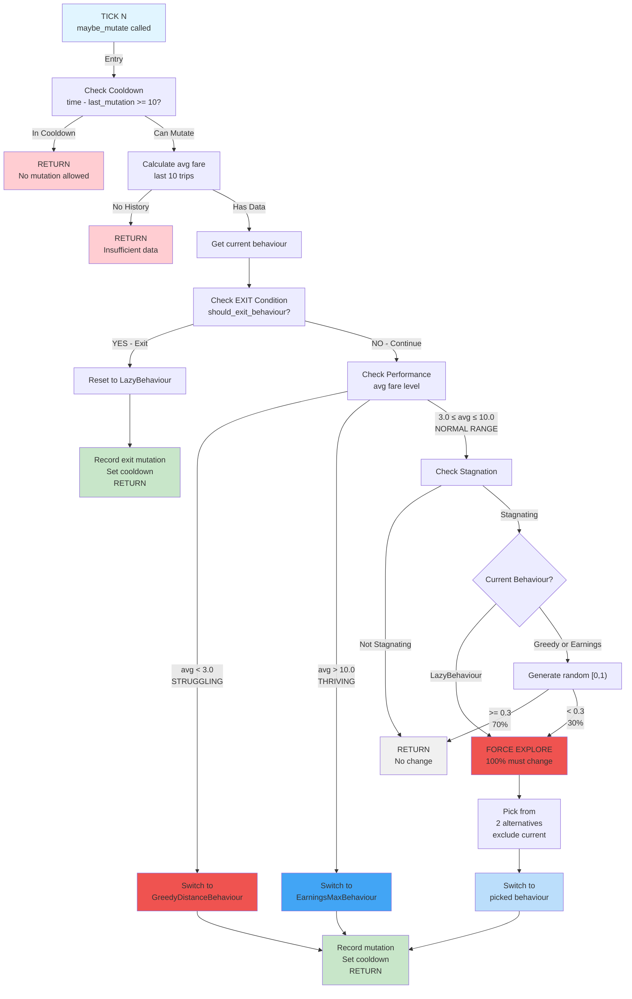

## 2. Earnings Zones and Exit Conditions

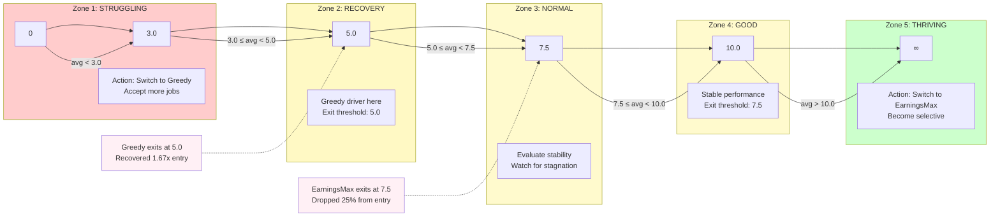

## 3. Stagnation Detection Algorithm

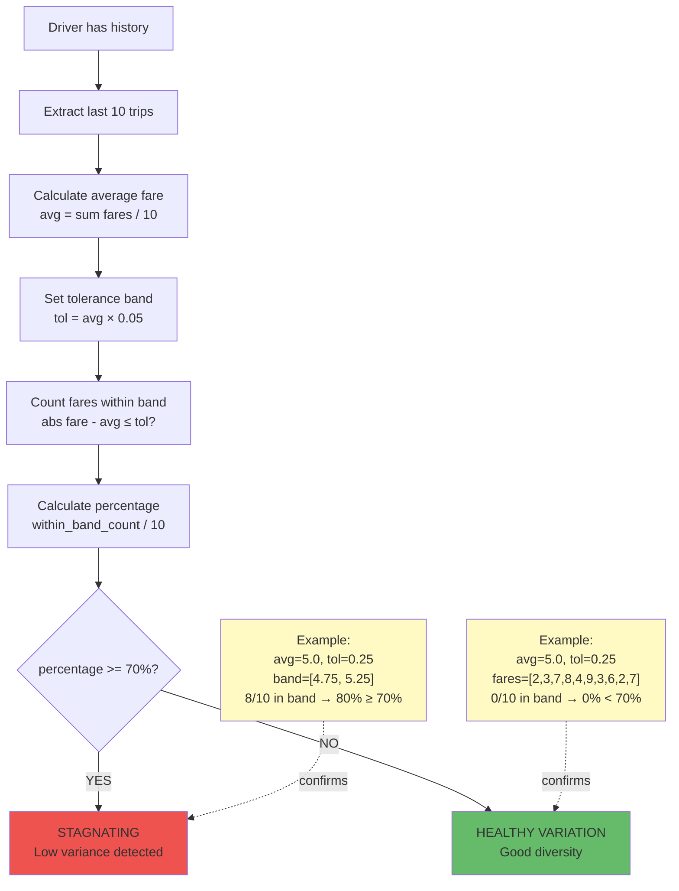

## 4. Exploration Mechanism (Stagnation Response)

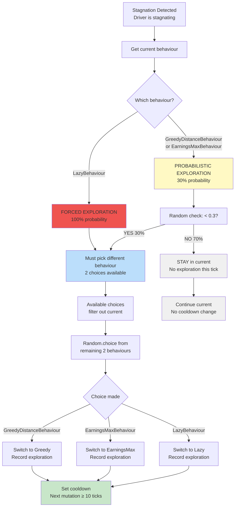

## 5. Exit Conditions by Behaviour

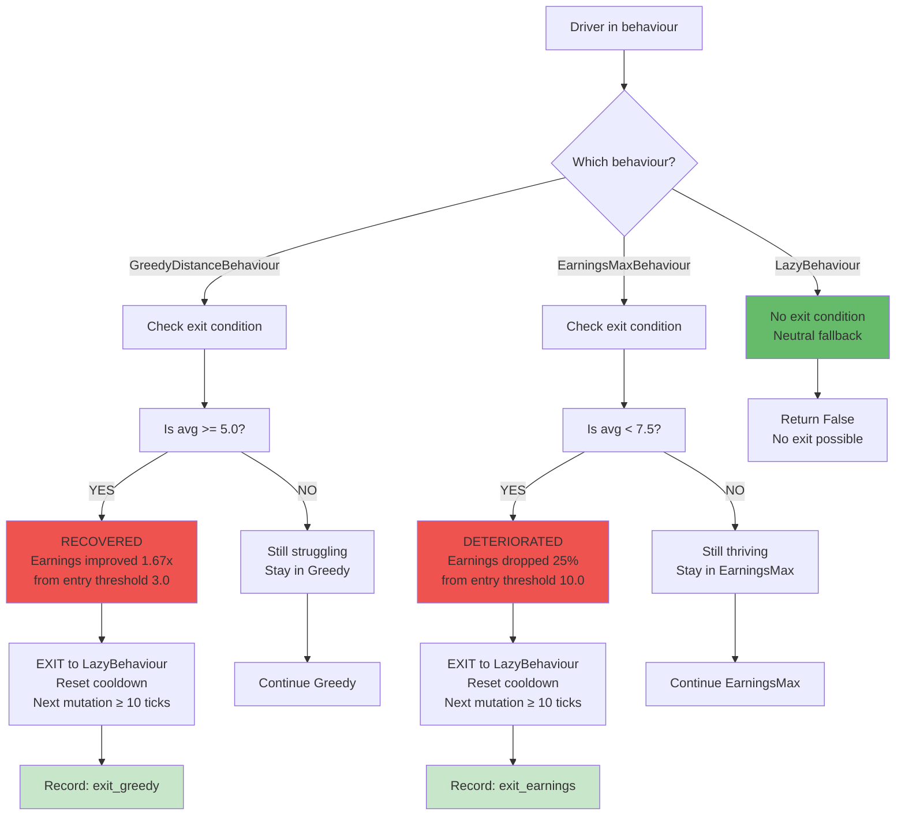

## 6. Behaviour State Transitions

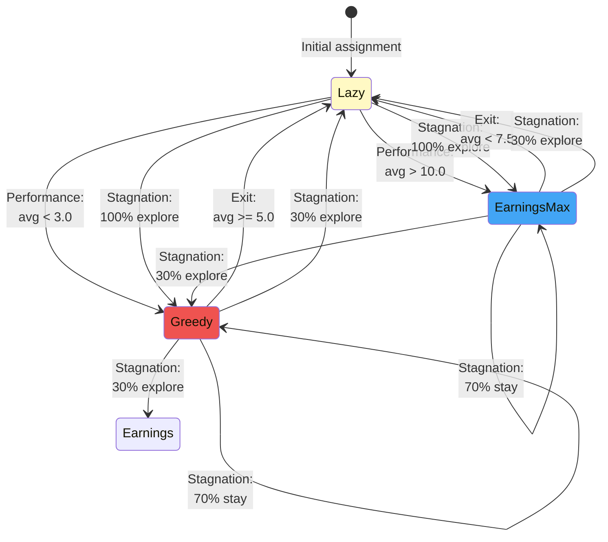

## 7. Cooldown Timeline and Mutation Windows

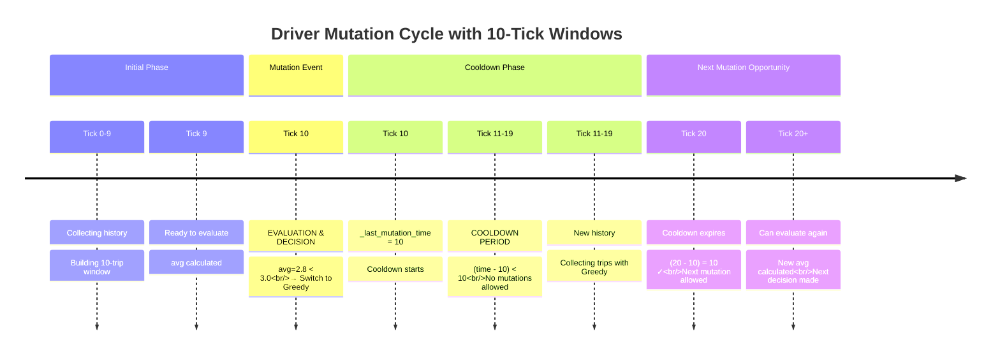

## 8. Performance-Based Primary Mutations

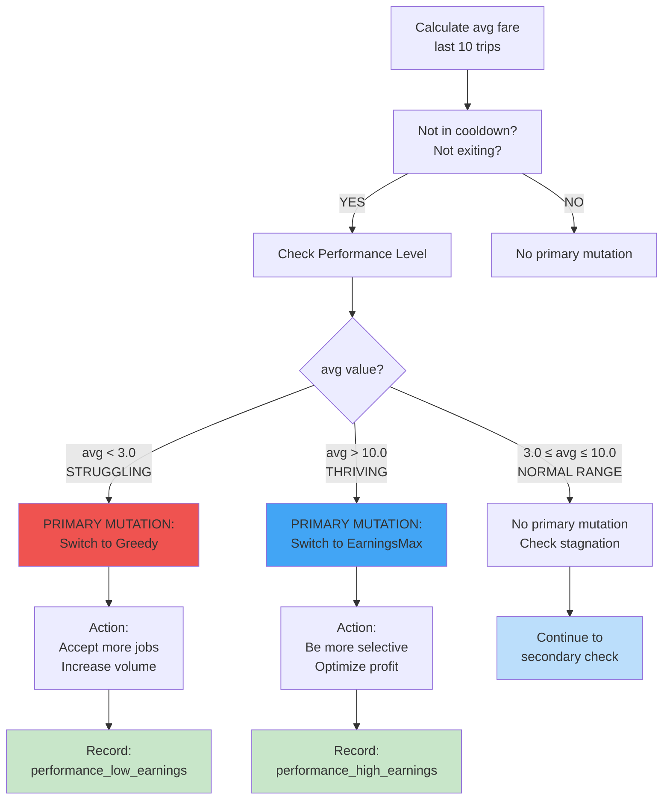

## 9. Secondary Stagnation-Based Mutations

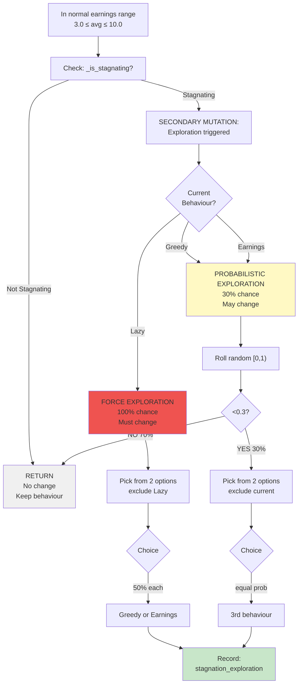

## 10. Exploration Choice Mechanism (Current Exclusion)

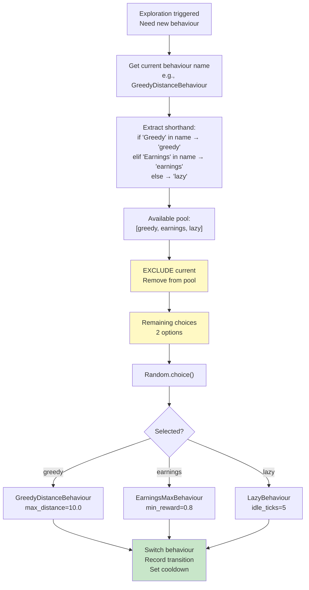

## 11. Mutation Recording and Tracking

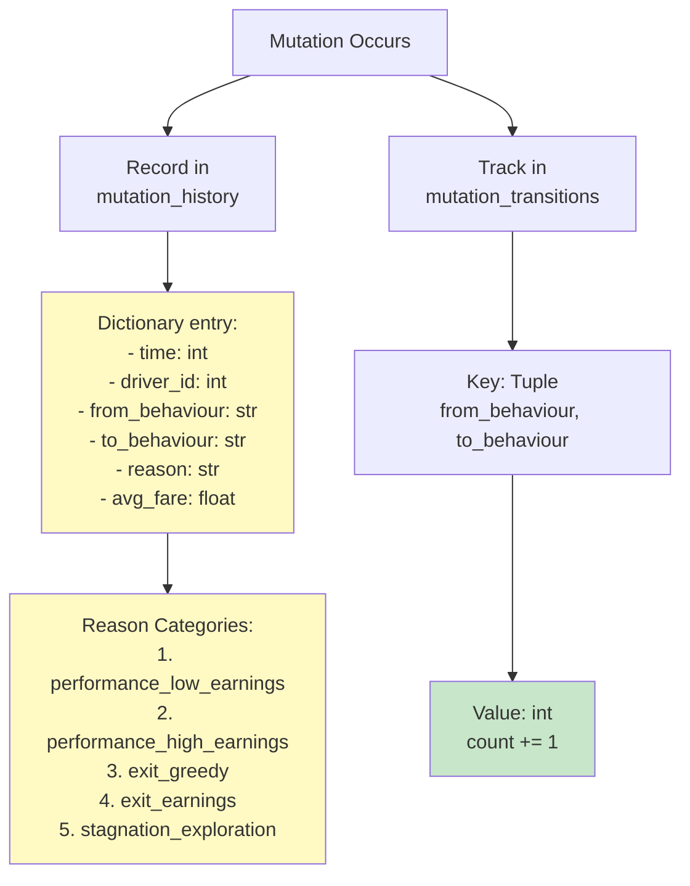

## 12. Complete Tick Sequence with Mutation

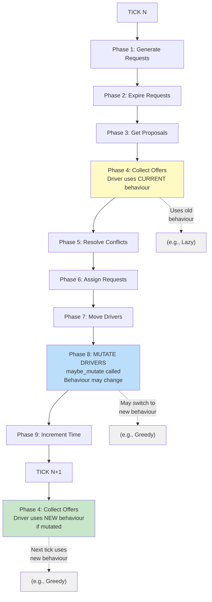

## 13. Data Flow: History → Decision → Mutation

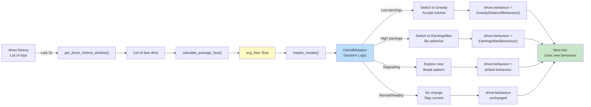

## 14. Hysteresis: Entry vs Exit Thresholds

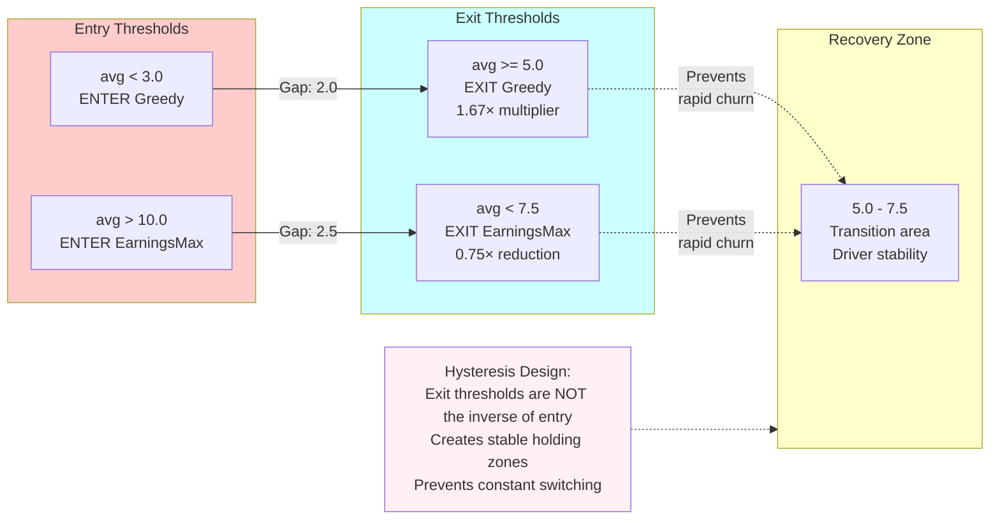

## 15. Summary: Mutation Decision Tree

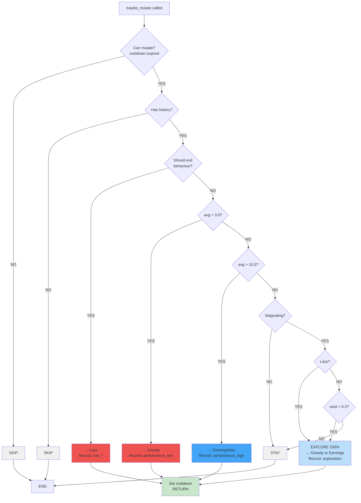

