# Mutation System Mermaid Diagrams (Updated)

Based on the current mutation.py implementation with:
- Fixed 10-tick evaluation window
- Aligned thresholds and cooldown
- Exploration that excludes current behaviour
- Hysteresis-based exit conditions

## 1. Complete Decision Flow (maybe_mutate)

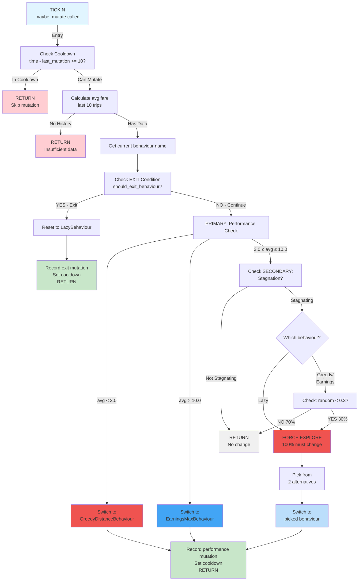

## 2. Earnings Zones (5 Decision Zones)

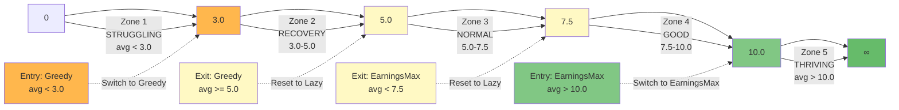

## 3. Stagnation Detection (Variance Algorithm)

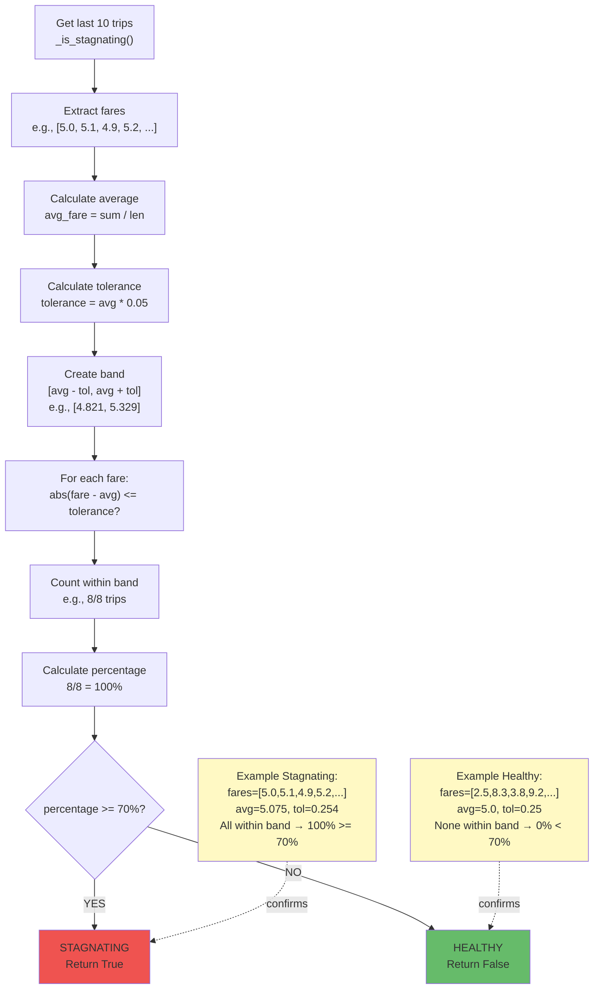

## 4. Exploration Mechanism (30% Rule with Lazy Forcing)

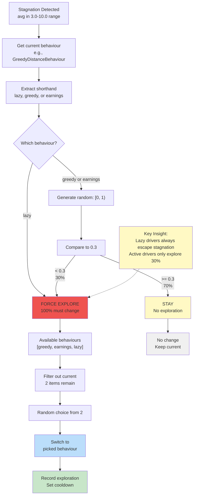

## 5. Exit Conditions (Hysteresis)

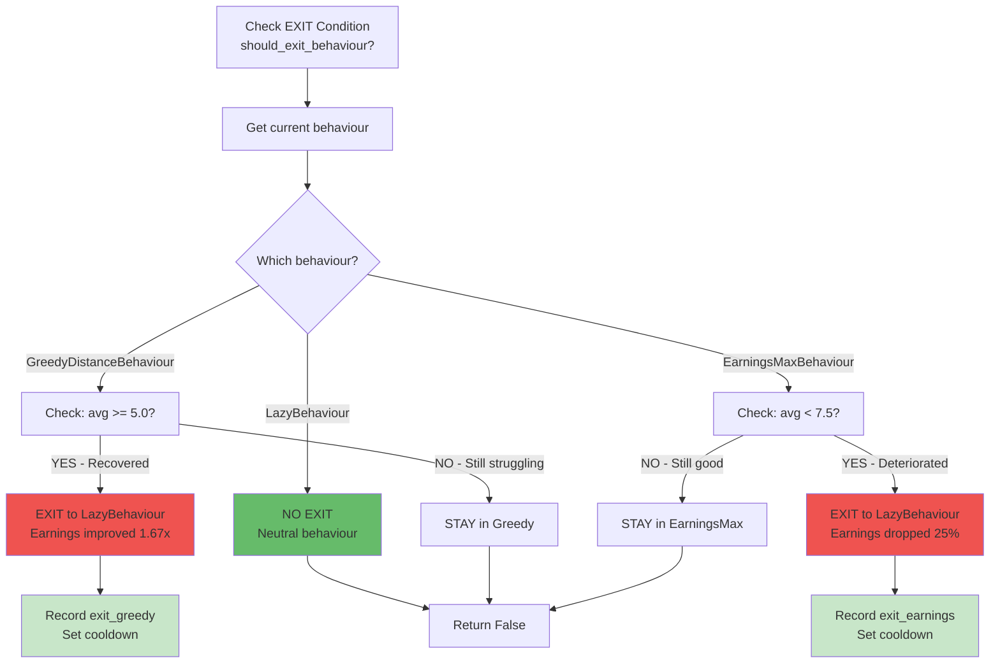

## 6. State Transition Graph

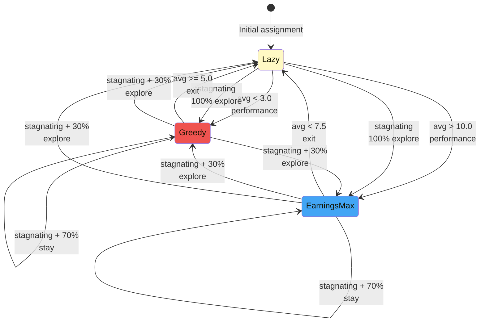

## 7. Cooldown and Evaluation Windows (Timeline)

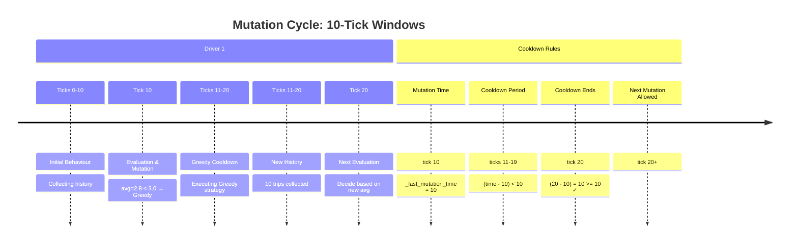

## 8. HybridMutation Initialization

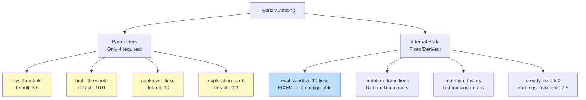

## 9. Behaviour Parameters

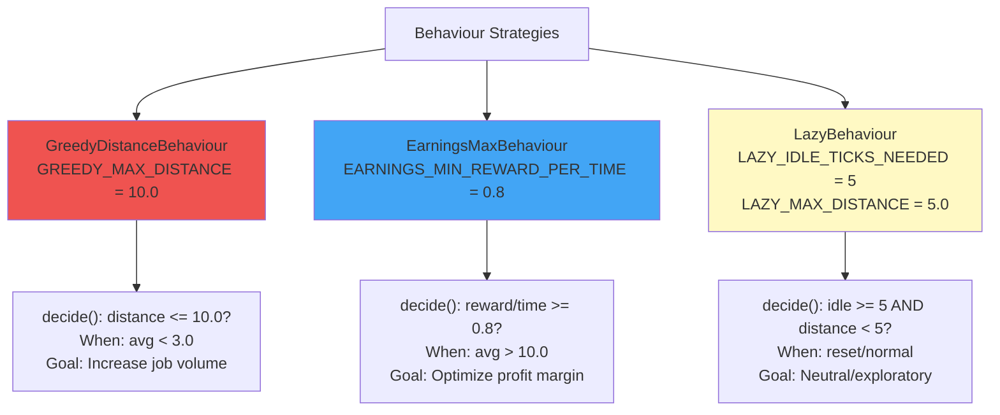

## 10. Complete Simulation Tick Sequence

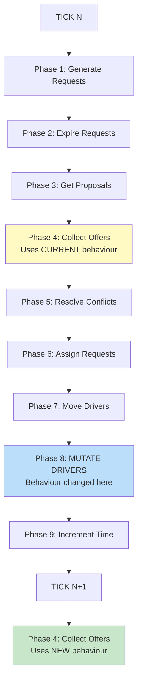

## 11. Mutation Recording & Data Tracking

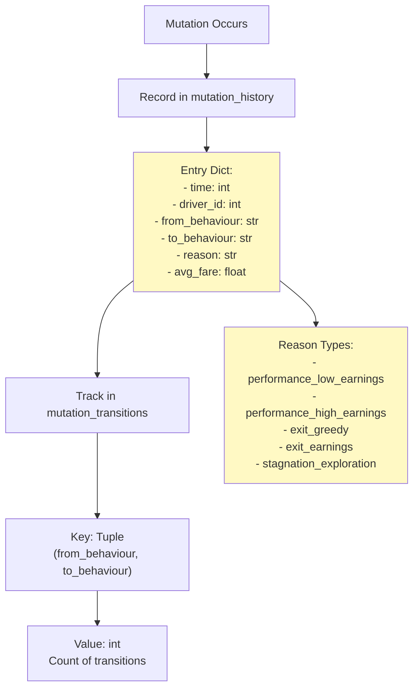

## 12. Data Flow: History to Mutation

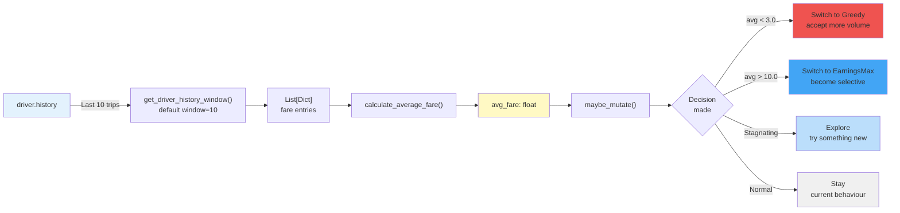

## 13. Stagnation Variance Algorithm Details

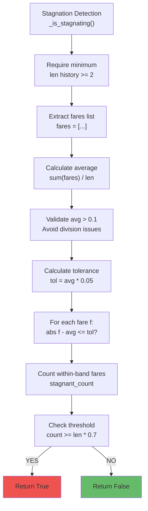

## 14. Exploration with Current Behaviour Exclusion

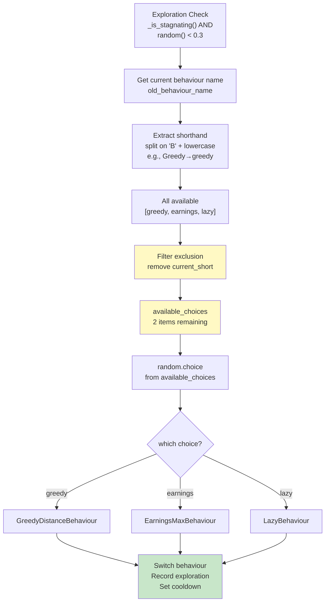

## 15. Mutation Metrics and Reporting

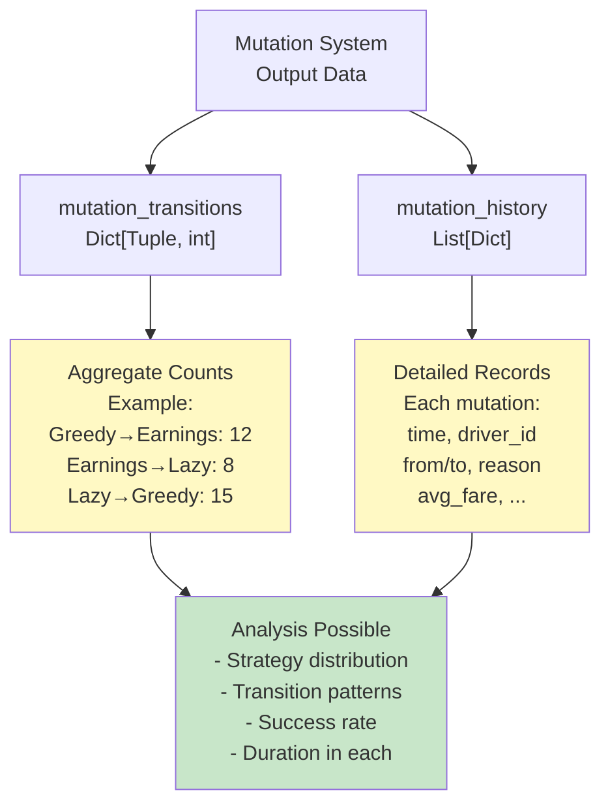

    HybridMutation --> Driver
    HybridMutation --> DriverBehaviour
    Driver --> DriverBehaviour
```

## Simplified View (Focus on Mutation)

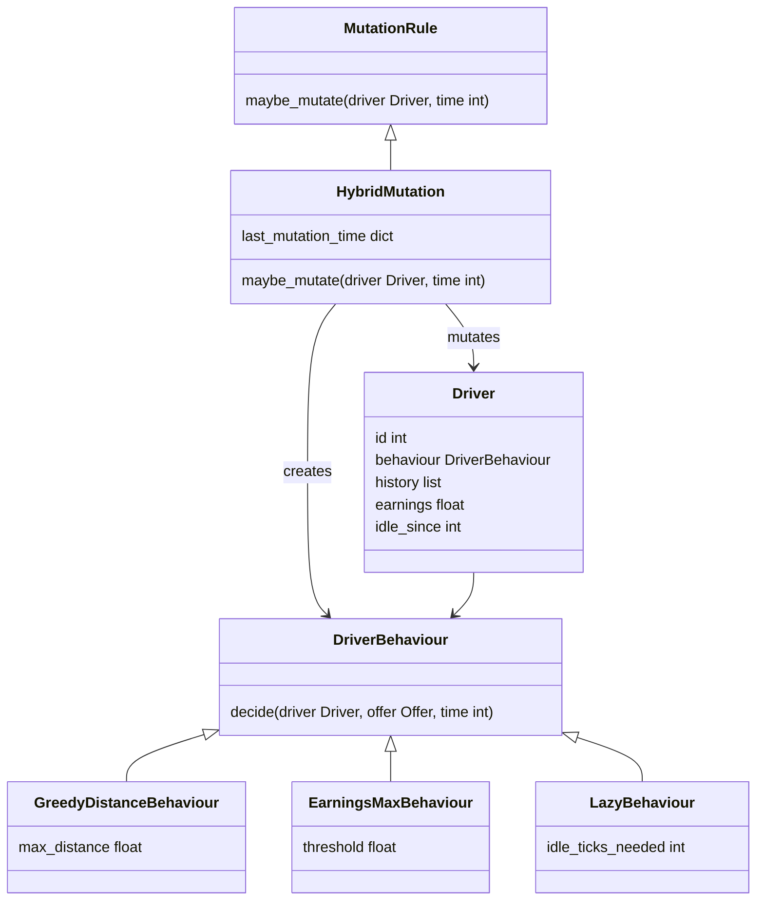

## Mutation Flow Diagram

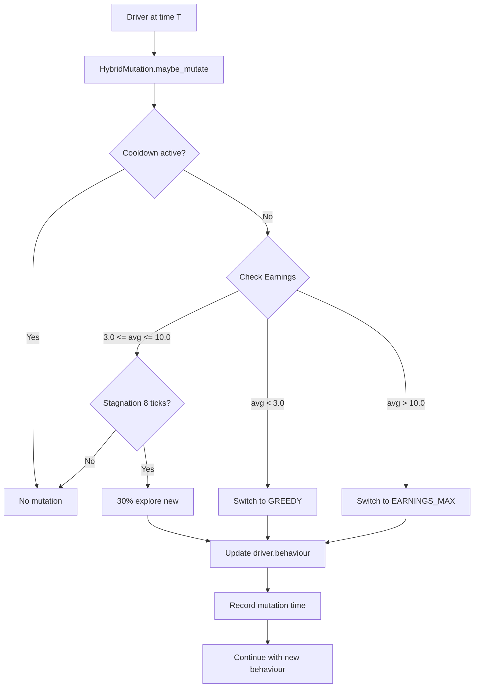

## State Machine: Behaviour Transitions

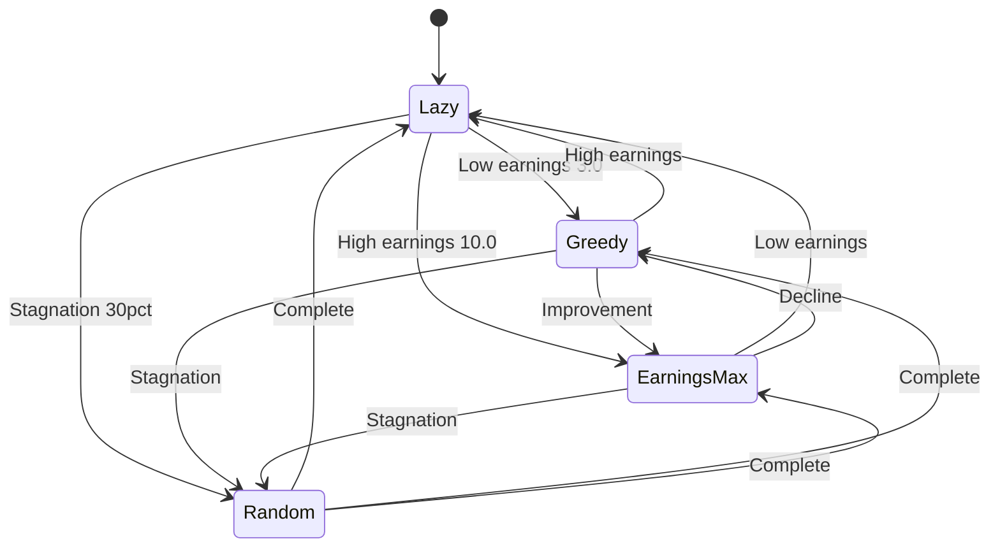

## Sequence Diagram: Mutation During Tick

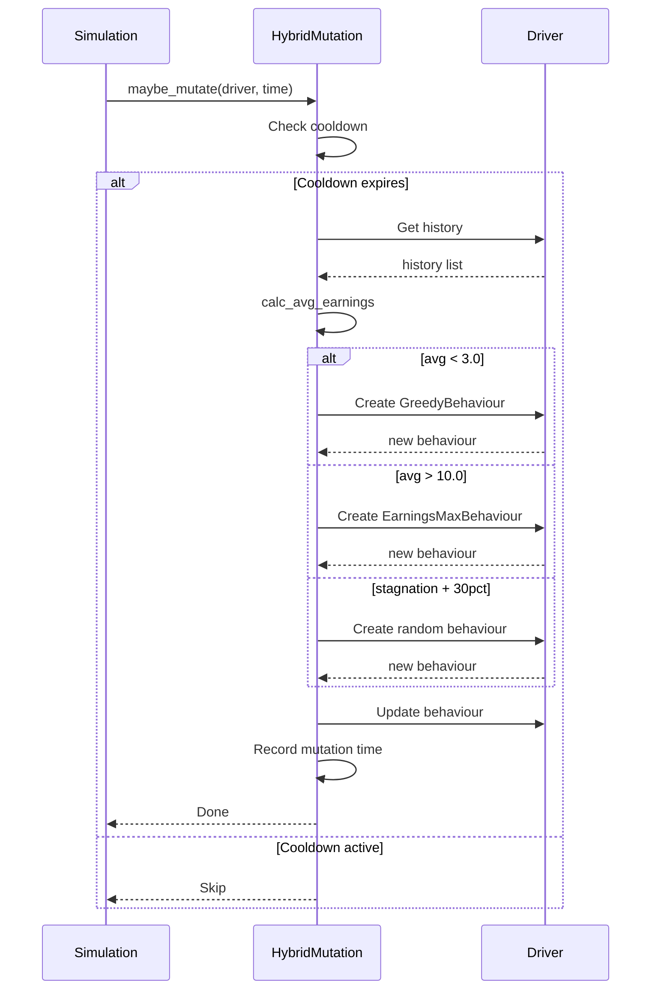

## Configuration Constants as Diagram

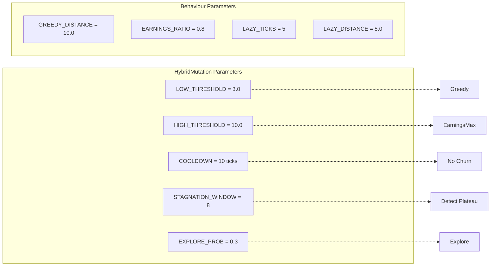

## Metrics Data Collection Pipeline

```mermaid
graph TD
    Sim["DeliverySimulation<br/>per tick"] --> T1["1. Generate Requests"]
    T1 --> T2["2. Expire Requests"]
    T2 --> T3["3. Propose Offers"]
    T3 --> T4["4. Collect Decisions"]
    T4 --> T5["5. Resolve Conflicts"]
    T5 --> T6["6. Assign Requests"]
    T6 --> T7["7. Move Drivers"]
    T7 --> T8["8. Mutate Drivers"]
    T8 --> T9["9. Increment Time"]
    
    T9 --> Snapshot["get_snapshot()"]
    Snapshot --> TS["SimulationTimeSeries<br/>record_tick"]
    
    TS --> M1["Track: served_count"]
    TS --> M2["Track: expired_count"]
    TS --> M3["Track: avg_wait"]
    TS --> M4["Track: pending_count"]
    TS --> M5["Track: utilization"]
    TS --> M6["Track: behaviour_dist"]
    TS --> M7["Track: mutations"]
    TS --> M8["Track: stagnation"]
    TS --> M9["Track: times"]
    
    M1 --> Storage["SimulationTimeSeries<br/>Storage"]
    M2 --> Storage
    M3 --> Storage
    M4 --> Storage
    M5 --> Storage
    M6 --> Storage
    M7 --> Storage
    M8 --> Storage
    M9 --> Storage
```

## Metrics to Visualizations Flow

```mermaid
graph TD
    Storage["SimulationTimeSeries<br/>Stored Data"] --> Report["generate_report"]
    
    Report --> W1["Window 1: Metrics Report"]
    Report --> W2["Window 2: Behaviour Analysis"]
    Report --> W3["Window 3: Mutation Analysis"]
    
    W1 --> P1A["Plot: Served vs Expired"]
    W1 --> P1B["Plot: Wait Time Evolution"]
    W1 --> P1C["Plot: Pending Requests"]
    W1 --> P1D["Plot: Driver Utilization"]
    W1 --> P1E["Plot: Summary Statistics"]
    
    W2 --> P2A["Plot: Behaviour Distribution"]
    W2 --> P2B["Plot: Behaviour Evolution"]
    W2 --> P2C["Stats: Behaviour Summary"]
    
    W3 --> P3A["Plot: Rule Configuration"]
    W3 --> P3B["Plot: Impact Metrics"]
    W3 --> P3C["Plot: Mutations/Stagnation"]
```

## Data Collection During Single Tick

```mermaid
graph LR
    subgraph "Tick Start"
        T1["time = N<br/>served = X<br/>expired = Y"]
    end
    
    subgraph "Phase Execution"
        P1["Generate"]
        P2["Expire"]
        P3["Propose"]
        P4["Collect"]
        P5["Resolve"]
        P6["Assign"]
        P7["Move"]
        P8["Mutate"]
    end
    
    subgraph "Tick End"
        T2["Accumulate:<br/>- New requests<br/>- Expired count<br/>- Completed trips<br/>- Updated earnings"]
    end
    
    subgraph "Record Metrics"
        R1["Calculate:<br/>- served += completed<br/>- expired += expired<br/>- avg_wait = total/count<br/>- pending = active<br/>- utilization = busy/total"]
    end
    
    subgraph "Store in TimeSeries"
        S1["times.append N"]
        S2["served.append X+delta"]
        S3["expired.append Y+delta"]
        S4["behaviour_dist.append dict"]
        S5["mutations.append total"]
        S6["stagnation.append count"]
    end
    
    T1 --> P1 --> P2 --> P3 --> P4 --> P5 --> P6 --> P7 --> P8
    P8 --> T2
    T2 --> R1
    R1 --> S1
    R1 --> S2
    R1 --> S3
    R1 --> S4
    R1 --> S5
    R1 --> S6
```

## Metrics Calculation Formulas

```mermaid
graph TD
    A["served_count"] -->|cumulative| A1["Total delivered"]
    B["expired_count"] -->|cumulative| B1["Total expired"]
    C["wait_time per request"] -->|average| C1["avg_wait = sum/count"]
    D["requests in system"] -->|count| D1["pending = WAITING+ASSIGNED+PICKED"]
    E["drivers with requests"] -->|ratio| E1["utilization = busy/total * 100%"]
    F["behaviour.__class__.__name__"] -->|histogram| F1["behaviour_dist = Counter"]
    G["mutation events"] -->|cumulative| G1["mutations = total_count"]
    H["unchanged behaviour"] -->|count| H1["stagnation = static_drivers"]
    
    A1 --> Calc["Statistical Summary"]
    B1 --> Calc
    C1 --> Calc
    D1 --> Calc
    E1 --> Calc
    F1 --> Calc
    G1 --> Calc
    H1 --> Calc
    
    Calc --> Out["Ready for Plotting"]
```

## Request Lifecycle Metrics

```mermaid
graph TD
    R["Request Created<br/>time=T0"] --> W["WAITING<br/>increment pending"]
    W --> A["ASSIGNED<br/>track target"]
    A --> P["PICKED<br/>wait_time updated"]
    P --> D["DELIVERED<br/>increment served<br/>record wait_time"]
    
    R --> E["EXPIRED<br/>age >= timeout<br/>increment expired"]
    
    D --> Stats["Update Statistics:<br/>served_count++<br/>avg_wait recalc"]
    E --> Stats
    
    Stats --> TS["Record in<br/>SimulationTimeSeries"]
```

## Behaviour Distribution Tracking

```mermaid
graph TD
    Drivers["All Drivers"] --> Extract["For each driver:<br/>get behaviour type"]
    Extract --> Count["Counter()"]
    
    Count --> C1["GreedyDistance<br/>count = 5"]
    Count --> C2["EarningsMax<br/>count = 3"]
    Count --> C3["LazyBehaviour<br/>count = 2"]
    
    C1 --> Dict["Dict:<br/>GreedyDistance: 5<br/>EarningsMax: 3<br/>LazyBehaviour: 2"]
    C2 --> Dict
    C3 --> Dict
    
    Dict --> TS["Append to<br/>behaviour_distribution<br/>list"]
    
    TS --> Time["Repeat every tick<br/>shows evolution"]
```
