# Mutation Class Diagram (Mermaid)

## Full Class Hierarchy

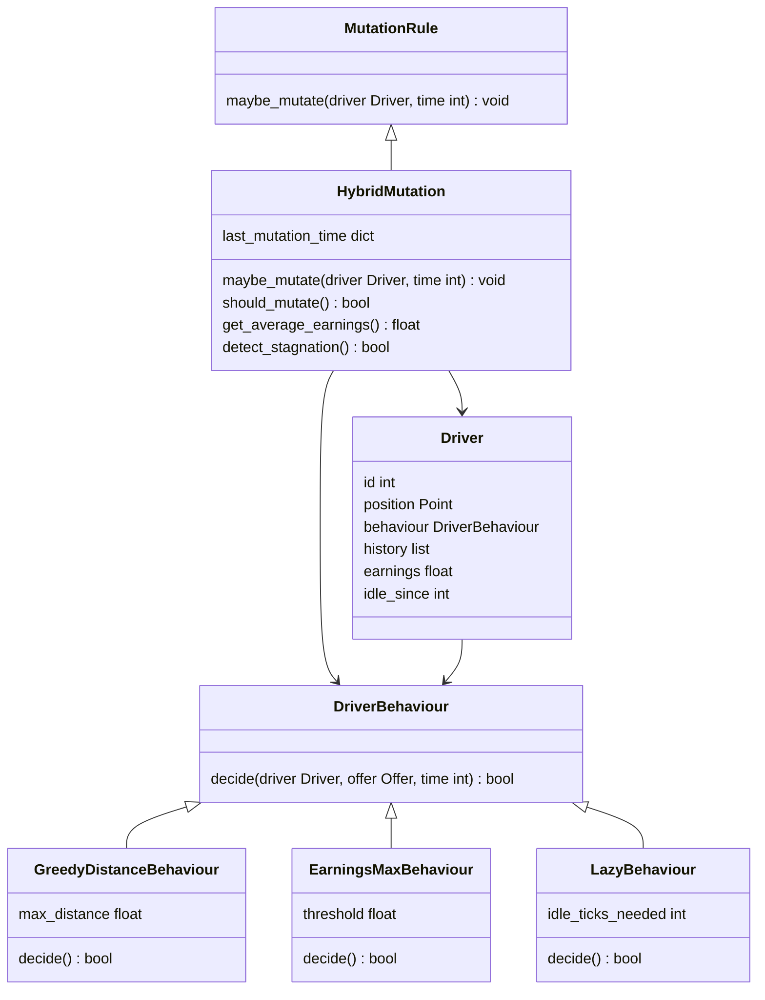

## Simplified View (Focus on Mutation)

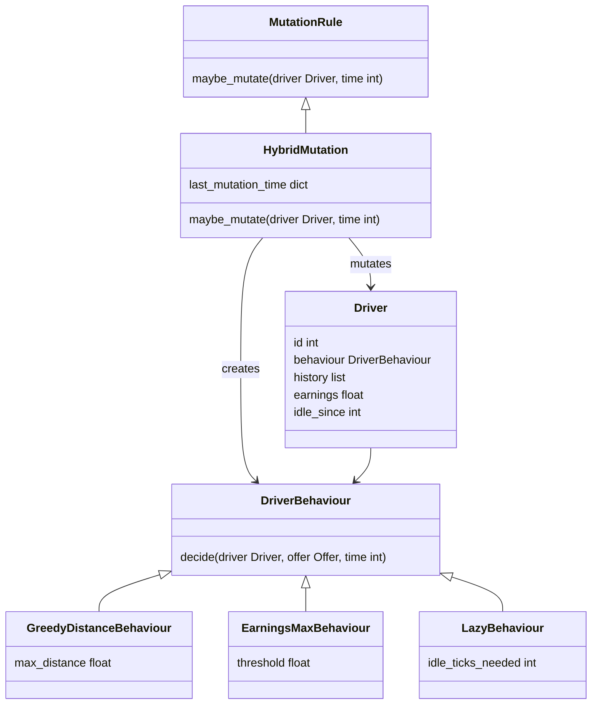

## Mutation Flow Diagram

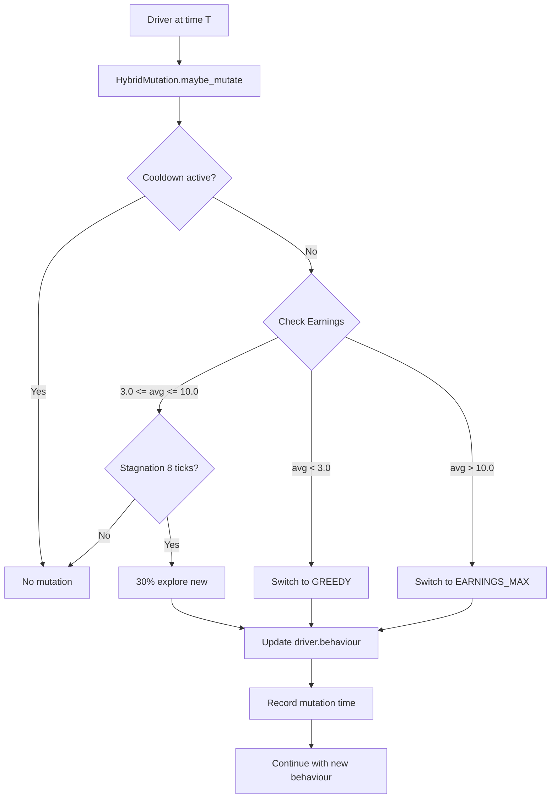

## State Machine: Behaviour Transitions

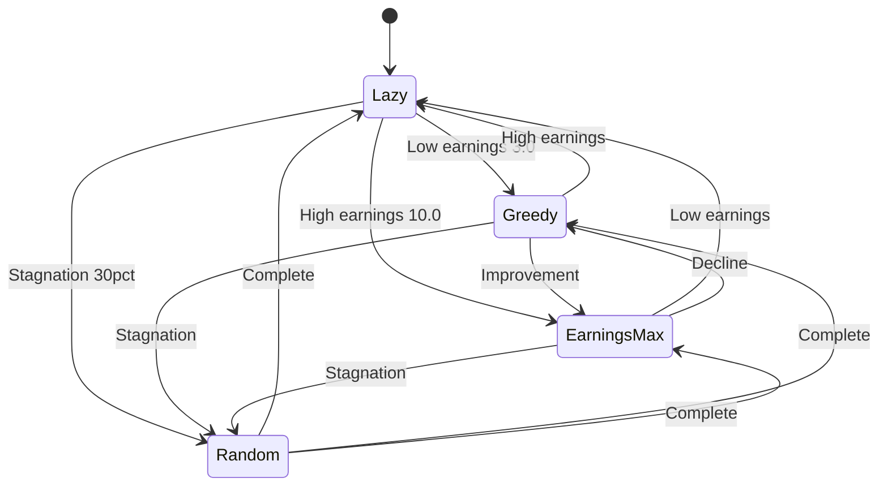

## Sequence Diagram: Mutation During Tick

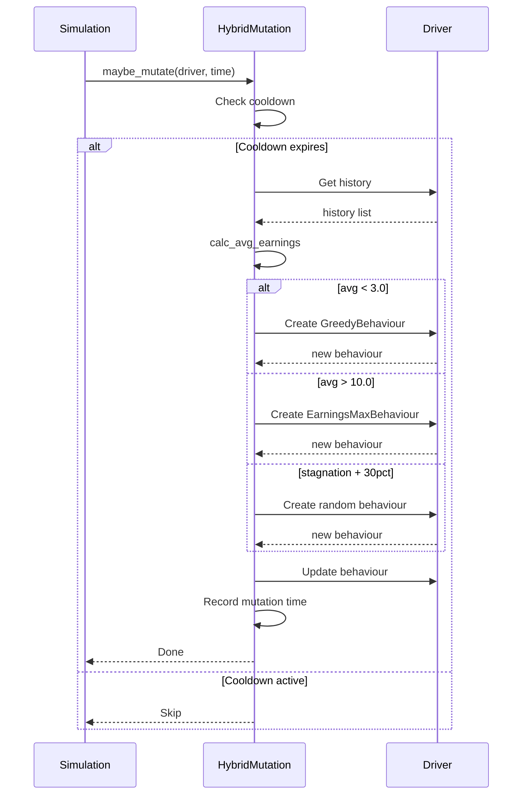

## Configuration Constants as Diagram

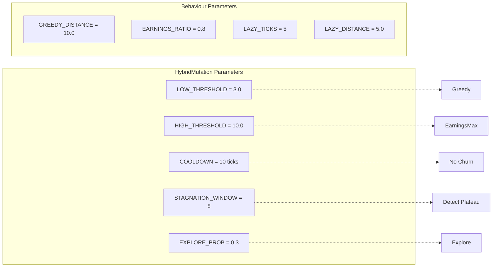

## Metrics Data Collection Pipeline

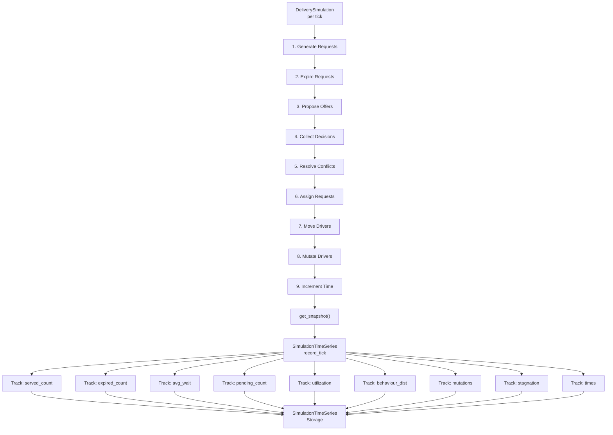

## Metrics to Visualizations Flow

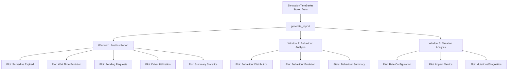

## Data Collection During Single Tick

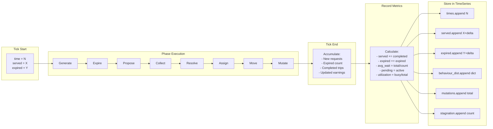

## Metrics Calculation Formulas

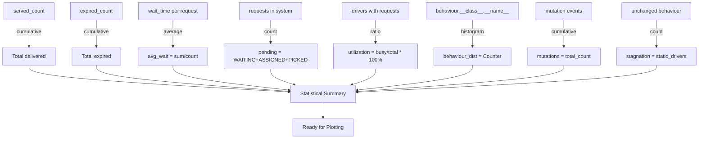

## Request Lifecycle Metrics

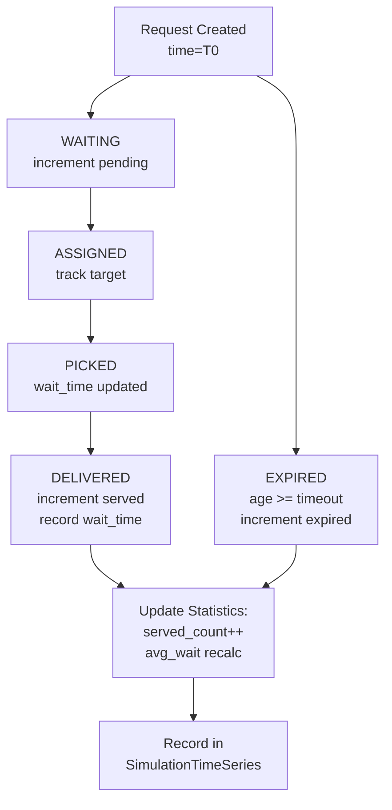

## Behaviour Distribution Tracking

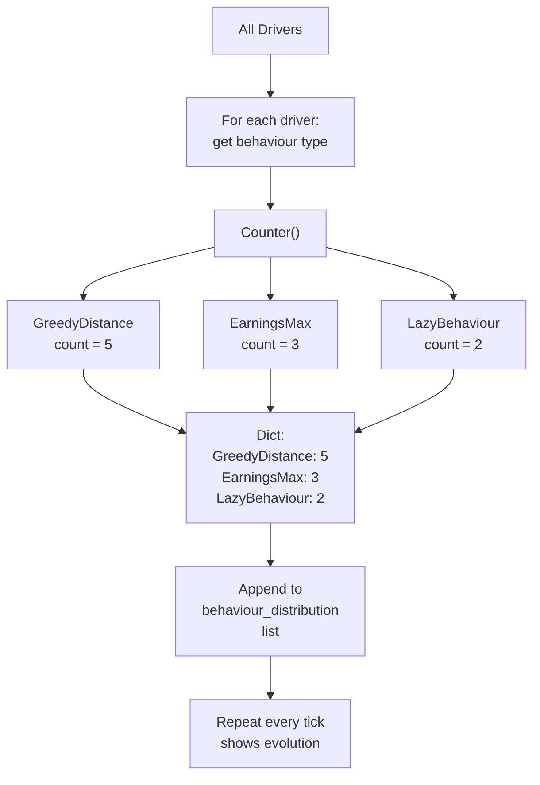
